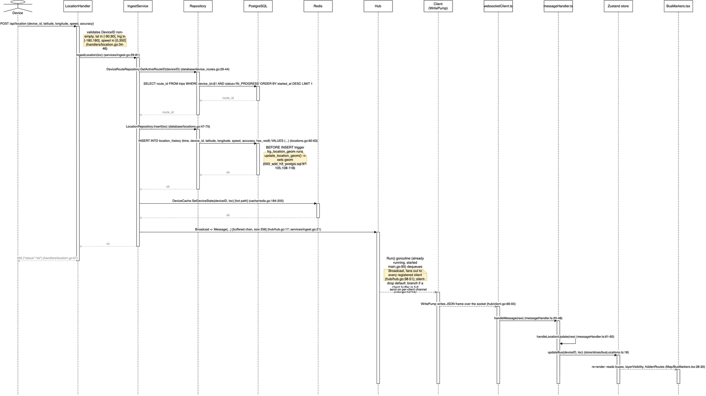
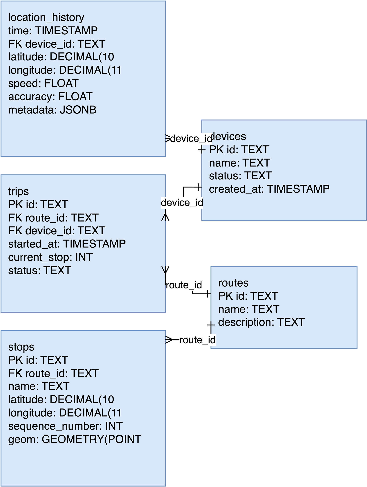
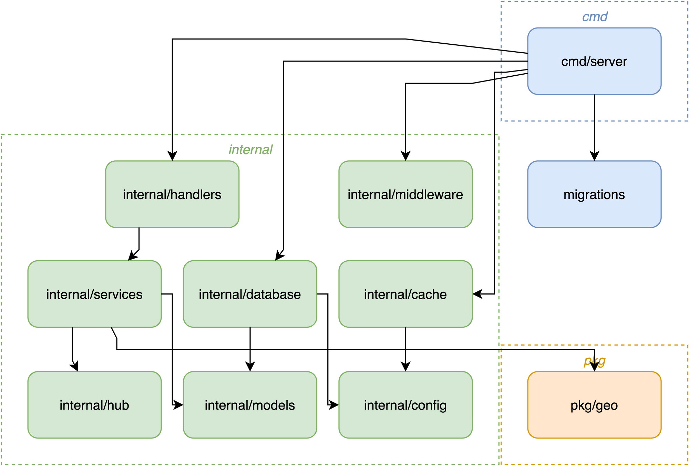
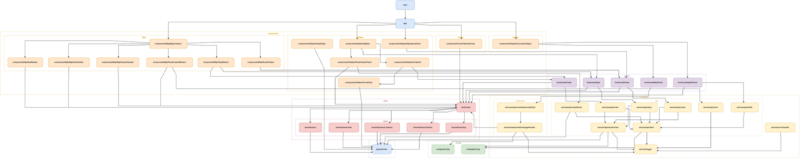

# LatitudeX Transit Engine: System Architecture & Design Specification

This document details the architectural principles, data flow pipelines, spatial mathematics, concurrency models, and database design of the LatitudeX Transit Engine.

---

## 1. System Overview & Context

LatitudeX Transit Engine is an event-driven telemetry and geofencing platform designed to ingest high-frequency GPS coordinate streams from moving devices and broadcast live positional updates and geofence predictions to browser clients in real time.


### Key Architectural Tenets
1. **High Ingestion Throughput**: Decouple the write ingestion pipeline from consumer broadcast fanout to ensure ingestion latency remains under microseconds regardless of connected client volume.
2. **Dual-Path Persistence**: Bifurcate every coordinate ping into a persistent, partitioned time-series store (TimescaleDB) for historical analytics and an in-memory geospatial cache (Redis) for instantaneous spatial lookups.
3. **Lock-Free Concurrency**: Isolate shared memory state, prevent goroutine leakage, and enforce zero-sleep synchronization across all concurrent streaming channels.
4. **Hybrid Spatial Indexing**: Utilize discrete hexagonal tiling (Uber H3) for rapid cell membership alongside continuous spherical calculations (PostGIS `GEOGRAPHY`) for boundary detection.

---

## 2. Lifecycle of a GPS Telemetry Ping

Every coordinate update follows a strictly bounded, non-blocking execution path through the backend engine:



### Step-by-Step Data Flow

```
Mobile Device / Simulator
        │
        │ 1. HTTP POST /api/location {device_id, latitude, longitude, speed, timestamp}
        ▼
┌──────────────────┐
│ Ingest Handler   │ ── 2. Validate coordinates (-90..90, -180..180) & speed (≥ 0)
└────────┬─────────┘
         │
         │ 3. IngestService.IngestLocation()
         ▼
┌──────────────────────────────────────────────┐
│                Ingestion Core                │
│                                              │
│  Path A: Persistent Time-Series              │  Path B: In-Memory Hot State
│  ┌───────────────────────────────┐           │  ┌───────────────────────────────┐
│  │ TimescaleDB `location_history`│           │  │ Redis Geo & Key-Value Cache   │
│  │ - Hypertable time partition   │           │  │ - GEOADD `devices:locations`  │
│  │ - PostGIS trigger populates   │           │  │ - HSET device metadata        │
│  │   POINT geometry column       │           │  │ - TTL expiration window       │
│  └───────────────────────────────┘           │  └───────────────┬───────────────┘
└──────────────────────────────────────────────┘                  │
                                                                  │ 4. Push to channel
                                                                  ▼
                                                       ┌─────────────────────┐
                                                       │  Hub.Broadcast Chan │
                                                       └──────────┬──────────┘
                                                                  │
                                                                  ▼
                                                       ┌─────────────────────┐
                                                       │ WebSocket Broadcast │
                                                       │ - Select non-block  │
                                                       │ - Fan out to N      │
                                                       │   client buffers    │
                                                       └──────────┬──────────┘
                                                                  │
                                                                  ▼
                                                       ┌─────────────────────┐
                                                       │ Client.WritePump    │
                                                       └──────────┬──────────┘
                                                                  │
                                                                  │ 5. WS Frame: LOCATION_UPDATE
                                                                  ▼
                                                       ┌─────────────────────┐
                                                       │ React / Zustand SPA │
                                                       │ - Leaflet SVG Move  │
                                                       └─────────────────────┘
```

1. **HTTP Ingestion**: The device emits a JSON payload to `POST /api/location`. Echo parses and binds the request, injecting UTC timestamps if omitted.
2. **Bounds & Validation**: The handler validates geographic coordinate ranges ($-90 \le \text{lat} \le 90$, $-180 \le \text{lng} \le 180$) and non-negative speed.
3. **Bifurcated Storage**:
   * **TimescaleDB (`location_history`)**: Appends to the active time-series hypertable chunk. A PostgreSQL trigger (`trg_location_geom`) automatically computes the PostGIS `POINT(longitude, latitude)` geometry in SRID 4326.
   * **Redis Hot State**: Issues a `GEOADD` into the active spatial set and updates key-value hash attributes with an expiring TTL.
4. **WebSocket Fanout**: The ingestion service pushes the canonical `hub.Message` envelope to the unbuffered `Hub.Broadcast` channel.
5. **Client Dispatch**: The hub event loop fans out the message to each registered client's 256-slot channel buffer. If a client's buffer is saturated, the drop is atomically recorded in `DroppedMessages` without blocking other subscribers.
6. **Reactive Map Render**: The client browser receives the JSON frame via WebSocket, updates the Zustand `DevicesSlice`, and translates the Leaflet SVG marker coordinates smoothly.

---

## 3. Concurrency Architecture & WebSocket Hub

The WebSocket distribution layer is built to eliminate contention, avoid memory leaks, and survive abrupt client disconnects:

### 1. Goroutine Topology & Mutex Isolation
* **Single Event Loop**: `Hub.Run` executes inside a dedicated event loop goroutine, handling registration, deregistration, and message broadcasts via `select`.
* **Per-Client Goroutine Pair**: Every active WebSocket connection spawns exactly two worker goroutines:
  * `WritePump`: Consumes from `client.Send` (256-slot buffer) and writes frames to the TCP socket with write deadlines. Emits periodic WebSocket pings (`pingPeriod = 54s`).
  * `ReadPump`: Handles control frames (pong responses, close requests) and enforces max message read sizes (`maxMessageSize = 512B`).
* **Mutex Isolation**: The `Hub.mu` read-write mutex protects the `Clients` map exclusively. It is acquired briefly to snapshot or mutate the subscriber registry and is **never held across socket I/O, channel sends, or timeouts**.

### 2. Graceful Shutdown Drain (The D28 Architecture)
A classic flaw in WebSocket hubs is dropping in-flight messages or deadlocking when the server terminates. LatitudeX implements a deterministic parallel drain:

```
context.Done()
      │
      ▼
┌─────────────────────────────────────────────────────────────┐
│ 1. Stop reading h.Broadcast (hard cutoff for late arrivals) │
│ 2. Acquire h.mu: snapshot []*Client and clear h.Clients map │
│ 3. Release h.mu (zero contention during wait window)        │
│ 4. Drain all clients in PARALLEL via sync.WaitGroup:        │
│    ┌───────────────────────────────────────────────────┐    │
│    │ drainAndClose(client):                            │    │
│    │ - If len(c.Send) == 0 -> close(c.Send) & return   │    │
│    │ - Poll len(c.Send) == 0 every 1ms                 │    │
│    │ - Timeout at 250ms -> log drop, record atomic     │    │
│    │   DroppedMessages, close(c.Send) & return         │    │
│    └───────────────────────────────────────────────────┘    │
│ 5. wg.Wait() finishes -> close(h.done) -> return            │
└─────────────────────────────────────────────────────────────┘
```

* **Go Channel Mechanics**: Closing a Go channel does *not* discard buffered values; receivers still read buffered messages until empty (`ok == false`). The shutdown drain waits for `WritePump` to consume the backlog before closing the channel.
* **Parallel Drain**: Draining sequentially would cost $N \times 250\text{ms}$. Draining concurrently with `sync.WaitGroup` bounds the entire shutdown duration to $\le 250\text{ms}$ total regardless of whether there are 10 or 1,000 clients.
* **Zero-Sleep Testing**: Concurrency tests avoid `time.Sleep`. Synchronization is asserted using deterministic polling loops bounded by deadlines under Go's `-race` detector.

---

## 4. Spatial Indexing & Geofencing Mathematics

The engine combines discrete hierarchical spatial tiling with spherical geometry calculations:

### 1. Uber H3 Hexagonal Grid (Resolution 9)
For localized vehicle searches (e.g., "find all devices near Zone $X$"), querying an R-Tree index across millions of global historical points can create disk I/O bottlenecks.

* **Resolution 9 Properties**:
  * Hexagon edge length: $\sim 107 \text{ meters}$
  * Cell surface area: $\sim 0.1 \text{ km}^2$
* **$O(1)$ Spatial Hash**: Coordinates are indexed into an 64-bit integer H3 cell ID. Spatial neighborhood lookups compute the $k$-ring set of neighboring hexagons ($k=1 \implies 7\text{ cells}$, $k=2 \implies 19\text{ cells}$) via pure bitwise arithmetic, transforming spatial proximity into a simple SQL `WHERE hex IN (...)` or Redis Set union query.

### 2. PostGIS Spherical Geometry & The SRID 4326 Trap
When computing real physical distances, PostGIS coordinates in spatial reference identifier 4326 (WGS 84 latitude/longitude) represent angular degrees on an ellipsoid, not linear meters.

> [!WARNING]
> **The Degree vs. Meter Trap**:
> Calling `ST_Length(geom)` or `ST_Distance(geom1, geom2)` on an SRID 4326 `geometry` calculates distance in **angular degrees**. A distance of $0.0234^{\circ}$ would be interpreted as 0.02 meters or kilometers by calling code—off by five orders of magnitude without throwing an error!

To prevent this:
* **Metric Distances**: All proximity functions (`ST_DWithin`, `ST_Distance`) explicitly cast coordinates to `::geography`:
  ```sql
  -- Computes accurate great-circle distance in METERS over the WGS84 spheroid
  SELECT id, name,
         ST_Distance(geom::geography, ST_SetSRID(ST_MakePoint($1, $2), 4326)::geography) AS distance_meters
  FROM zones
  WHERE ST_DWithin(geom::geography, ST_SetSRID(ST_MakePoint($1, $2), 4326)::geography, $3)
  ORDER BY distance_meters ASC;
  ```
* **Dimensionless Operations**: Functions such as `ST_LineLocatePoint` operate purely on `geometry` (returning a dimensionless ratio from $0.0$ to $1.0$) and do not cast to geography.

### 3. Geofence Boundary Hysteresis
To prevent telemetry jitter from triggering continuous enter/exit oscillation when a device hovers on a geofence boundary, the `GeofencingService` implements hysteresis thresholding:
* **Entry Radius ($R_{\text{in}}$)**: e.g., $50\text{ meters}$
* **Exit Radius ($R_{\text{out}}$)**: e.g., $75\text{ meters}$ ($R_{\text{out}} > R_{\text{in}}$)

A device inside a zone remains classified as "inside" until its distance strictly exceeds $R_{\text{out}}$, preventing rapid-fire duplicate arrival/departure events.

---

## 5. Database Schema & Persistence Model

The relational schema is managed through embedded, idempotent SQL migrations:



### Schema Architecture
* **`devices`**: Master roster of tracked mobile hardware (`id`, `name`, `status`, `created_at`).
* **`routes`**: Predefined navigational paths (`id`, `name`, `description`).
* **`zones`**: Physical regions of interest / checkpoints (`id`, `route_id`, `name`, `latitude`, `longitude`, `sequence_number`, `geom`).
  * Optimized with a GiST spatial index: `idx_zones_geom ON zones USING GIST (geom)`.
* **`trips`**: Active assignments linking a device to a scheduled route (`id`, `device_id`, `route_id`, `start_time`, `end_time`, `status`, `current_stop`).
* **`location_history` (TimescaleDB Hypertable)**: High-frequency telemetry log partitioned across chunk intervals:
  ```sql
  CREATE TABLE location_history (
      id UUID DEFAULT gen_random_uuid(),
      device_id TEXT NOT NULL,
      latitude DOUBLE PRECISION NOT NULL,
      longitude DOUBLE PRECISION NOT NULL,
      speed DOUBLE PRECISION NOT NULL,
      timestamp TIMESTAMPTZ NOT NULL,
      geom GEOMETRY(POINT, 4326),
      h3_hex TEXT
  );
  SELECT create_hypertable('location_history', 'timestamp');
  CREATE INDEX idx_location_history_geom ON location_history USING GIST (geom);
  ```

### Migration Pipeline
Database migrations live in `backend/migrations/` and are embedded directly into the Go application binary via `//go:embed *.sql`:
1. `001_create_tables.sql`: Base tables and TimescaleDB hypertable initialization.
2. `002_add_indexes.sql`: B-Tree and GiST spatial indexes.
3. `003_add_h3_postgis.sql`: PostGIS extension setup and automated geometry triggers.
4. `004_seed_data.sql`: Seed fixtures (demo routes, zones, devices, and initial telemetry points).
5. `005_rename_stops_zones.sql`: Idempotent domain vocabulary migration (aligning schema to generic zones).

---

## 6. Software Architecture & Module Boundaries

The backend strictly adheres to Clean Architecture layering, verified automatically in CI via `scripts/gate.sh`:



### Dependency Invariants
```
   ┌──────────┐
   │ Handlers │ ── HTTP & WebSocket request parsing, payload validation
   └────┬─────┘
        │ imports
        ▼
   ┌──────────┐
   │ Services │ ── Business logic, geofencing rules, coordinates math
   └────┬─────┘
        │ imports
        ▼
   ┌──────────┐
   │ Database │ ── SQL persistence, pgx/v5 pools, TimescaleDB queries
   └────┬─────┘
        │ imports
        ▼
   ┌──────────┐
   │  Models  │ ── Pure data transfer structures (zero third-party dependencies)
   └──────────┘
```

* **Unidirectional Dependency Flow**: `handlers` $\to$ `services` $\to$ `database`/`cache` $\to$ `models`.
* **No Reverse or Circular Imports**: `database` never imports `services`; `models` never imports any internal package.
* **Interface Decoupling**: Services depend on repository interfaces (`ZoneRepository`, `DeviceRepository`, `LocationRepository`), enabling straightforward unit testing with mock implementations.

---

## 7. Frontend State Management & UI Architecture

The frontend is a lightweight, high-framerate React 19 SPA optimized for continuous Leaflet map manipulation:



### Zustand State Slices
Global state is partitioned into isolated Zustand store slices to eliminate unnecessary re-renders:
* **`DevicesSlice`**: Hashmap of active device coordinates and trajectories (`Record<string, DeviceLocation>`).
* **`ZonesSlice`**: Geographic points of interest and geofence radii.
* **`GeofenceEventsSlice`**: Rolling feed of arrivals, departures, and estimated time of arrival (ETA) predictions.
* **`UISlice`**: Selection states (e.g., `selectedZoneId`, `followedDeviceId`), layer visibility toggles, and route-creator waypoint buffers.

### Map Rendering Optimizations
* **Marker Reconciliation**: Device locations are stored as discrete state objects; marker movements update Leaflet position coordinates directly on the map layer without re-mounting the canvas.
* **WebSocket Heartbeats**: Auto-reconnecting client (`websocketClient.ts`) monitors connection state with exponential backoff and seamless reconnects.
