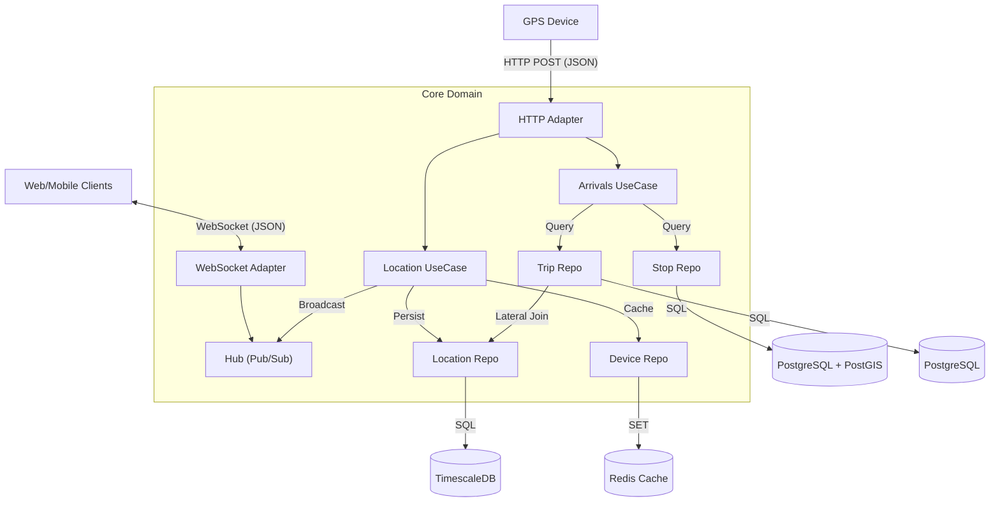
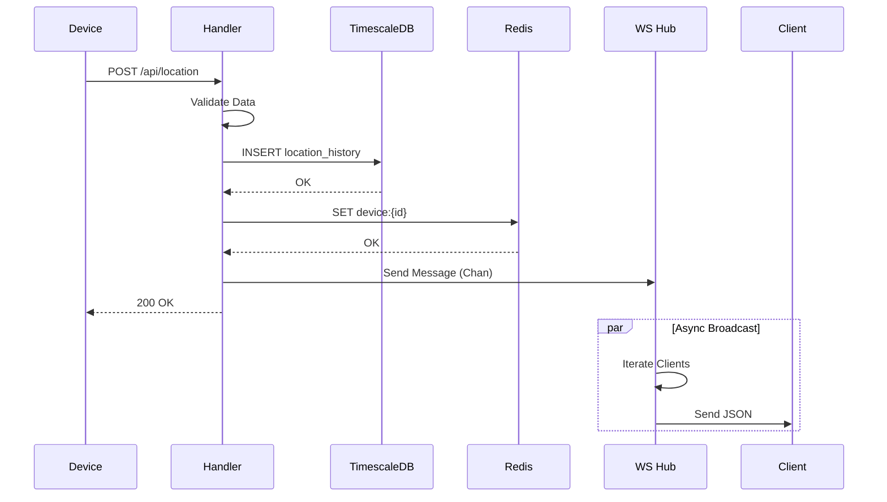

# Transit Backend - High-Level & Low-Level Design (LLD)

## 1. Introduction
This document provides a comprehensive technical specification for the Transit Backend system. It covers the architecture, data flows, concurrency models, database schema, and interface contracts in minute detail.

## 2. System Architecture

The system is built as a monolithic service in Go, following the Clean Architecture pattern to separate transport (HTTP/WS), business logic (Use Cases), and data access (Repositories).

### 2.1. High-Level Diagram



### 2.2. Concurrency Model
The Go runtime is utilized for high concurrency:
-   **HTTP Server**: The `Echo` framework spawns a goroutine per request.
-   **WebSocket Hub**: Runs as a single "actor" goroutine managing the state of all connections to avoid mutex contention on the map.
-   **Client Pumps**: Each connected WebSocket client has two dedicated goroutines:
    -   `ReadPump`: Reads from the socket (handles pongs, close frames).
    -   `WritePump`: Writes to the socket (message serialization, pings).
-   **Synchronization**: `sync.RWMutex` is used in the `Hub` to protect the `clients` map during registration/unregistration vs broadcasting.

## 3. Detailed Component Design

### 3.1. Location Ingestion (Write Path)
**Endpoint**: `POST /api/location`
**Handler**: `IngestLocation`

**Sequence of Operations**:
1.  **Parsing & Validation**:
    -   Decode JSON body to `models.Location`.
    -   Check `Latitude` [-90, 90], `Longitude` [-180, 180].
    -   Check `Speed` [0, 350] km/h.
    -   If `Timestamp` is 0, set to `time.Now().Unix()`.
2.  **Persistence (TimescaleDB)**:
    -   Executes `INSERT INTO location_history`.
    -   Uses `context.Background()` with timeout derived from request context.
    -   *Failure Strategy*: strong consistency. If DB insert fails, return 500.
3.  **Cache Update (Redis)**:
    -   Key: `device:{device_id}`.
    -   Value: JSON object `{lat, lng, speed, last_seen}`.
    -   TTL: 1 Hour.
    -   *Failure Strategy*: best effort. Log error but do not fail request.
4.  **Broadcast (WebSocket)**:
    -   Construct `hub.Message` (Type: `LOCATION_UPDATE`).
    -   Send to `Hub.Broadcast` channel.
    -   *Non-blocking*: If channel is full, the handler waits (or could drop, but currently blocks).

**Sequence Diagram**:


### 3.2. Real-Time Arrivals (Read Path)
**Endpoint**: `GET /api/arrivals`
**Handler**: `GetArrivals`

**Algorithm**:
1.  **Input**: `stop_id`.
2.  **Step 1**: Fetch `Stop` details (sequence number, lat/lon) from `stops` table.
3.  **Step 2**: Identify Active Trips.
    -   Query `trips` table where `route_id = stop.route_id` AND `status = 'IN_PROGRESS'` AND `current_stop < stop.sequence`.
4.  **Step 3**: Fetch Latest Positions (Optimization).
    -   Instead of N+1 queries, use a single query with **LATERAL JOIN**:
        ```sql
        SELECT t.id, lh.latitude, lh.longitude, lh.speed 
        FROM trips t
        JOIN LATERAL (
            SELECT latitude, longitude, speed 
            FROM location_history 
            WHERE device_id = t.device_id 
            ORDER BY time DESC LIMIT 1
        ) lh ON true
        WHERE ...
        ```
5.  **Step 4**: Compute ETA.
    -   For each trip, calculate Haversine Distance ($$d$$) between bus location and stop location.
    -   If $speed < 1.0$ (stopped), assume $speed = 20.0$ km/h.
    -   $$ETA_{mins} = \frac{d}{speed} \times 60$$.
6.  **Response**: List of `{trip_id, device_id, eta_minutes}`.

### 3.3. WebSocket Hub internals
**File**: `internal/hub/hub.go`

**Data Structures**:
-   `clients`: `map[*Client]bool`. key is pointer to Client struct. Value is boolean (set).
-   `register`: `chan *Client`. Unbuffered.
-   `unregister`: `chan *Client`. Unbuffered.
-   `broadcast`: `chan interface{}`. Buffer size 256.

**Broadcast Logic**:
When `Hub.run()` receives a message on `broadcast` channel:
1.  Acquires `RLock` on `mu`.
2.  Iterates through `clients` map.
3.  Performs **Non-Blocking Send** to `client.Send` channel:
    ```go
    select {
    case client.Send <- message:
        // success
    default:
        // Client buffer full. Skip to prevent blocking others.
        // Potential future improvement: Disconnect slow consumer.
    }
    ```
4.  Releases `RUnlock`.

## 4. Database Schema (Detailed)

### 4.1. Tables

**`devices`**
| Column | Type | Constraints | Description |
| :--- | :--- | :--- | :--- |
| `id` | `TEXT` | `PRIMARY KEY` | Unique device identifier (e.g. 'bus-001') |
| `name` | `TEXT` | | Human readable name |
| `status` | `TEXT` | | Operational status |

**`location_history` (Hypertable)**
| Column | Type | Constraints | Description |
| :--- | :--- | :--- | :--- |
| `time` | `TIMESTAMP` | `NOT NULL` | Partition key for TimescaleDB |
| `device_id` | `TEXT` | `FK -> devices.id` | The vehicle reporting |
| `latitude` | `DECIMAL(10,8)`| | GPS Latitude |
| `longitude`| `DECIMAL(11,8)`| | GPS Longitude |
| `speed` | `FLOAT` | | Speed in km/h |
| `accuracy` | `FLOAT` | | GPS accuracy radius in meters |
| `metadata` | `JSONB` | | Extra telemetry |

*Indexes*:
-   `(device_id, time DESC)`: Optimized for "latest location" queries.
-   `time`: Implicitly indexed by TimescaleDB partitions.

**`stops`**
| Column | Type | Constraints | Description |
| :--- | :--- | :--- | :--- |
| `id` | `TEXT` | `PRIMARY KEY` | |
| `route_id` | `TEXT` | `FK -> routes.id` | |
| `geom` | `GEOMETRY(POINT, 4326)` | | PostGIS spatial point |
| `sequence` | `INT` | | Order in the route |

*Indexes*:
-   `idx_stops_geom` (GIST): Enables fast "find stops near me" queries.

## 5. Deployment & Configuration

### 5.1. Environment Variables
The application follows the 12-factor app methodology using `godotenv`.

| Variable | Required | Default | Description |
| :--- | :---: | :--- | :--- |
| `DB_HOST` | Yes | - | PostgreSQL Host |
| `DB_PORT` | Yes | 5432 | PostgreSQL Port |
| `REDIS_HOST` | Yes | - | Redis Host |
| `SERVER_PORT`| No | 8080 | HTTP Listen Port |
| `LOG_LEVEL` | No | info | Log verbosity |

### 5.2. Docker
Multi-stage build to ensure minimal image size (~15MB compressed).
-   **Build Stage**: `golang:1.21-alpine`. Compiles static binary.
-   **Runtime Stage**: `alpine:latest`. Contains binary + migrations + public assets.

## 6. Failure Scenarios

1.  **Database Down**:
    -   API returns `500 Internal Server Error`.
    -   Health check (if implemented) fails.
    -   Redis cache might still serve read-only data (if logic allowed, though currently `arrivals` depends on DB).
2.  **Redis Down**:
    -   `IngestLocation` logs error but **succeeds** (Design choice: Data safety > Cache freshness).
    -   Read-caching (if utilized) would fallback to DB.
3.  **Slow WebSocket Client**:
    -   Client's output buffer fills up (buffer=256).
    -   Hub drops messages for that specific client (Non-blocking send).
    -   Client effectively experiences "lag" or "skips" but doesn't crash server.

## 7. Future Improvements
-   **Authentication**: Add JWT middleware for API and WebSocket upgrade.
-   **Binary Protocol**: Switch WS payload to Protobuf for bandwidth saving.
-   **Horizontal Scaling**: Introduce Redis Pub/Sub so multiple Backend instances can broadcast messages to each other's connected clients.
