# LatitudeX Backend - Comprehensive Component Documentation

> A highly detailed breakdown of every component in the LatitudeX backend system, explaining what each component does, how it works internally, what it connects to, why it is placed where it is, and the specific advantages of using it.

---

## Table of Contents

1. [Go Language Fundamentals for This Project](#go-language-fundamentals-for-this-project)
2. [Software Engineering Design Principles](#software-engineering-design-principles)
3. [System Overview](#system-overview)
4. [Repository Structure](#repository-structure)
5. [Core Go Backend (`transit-backend/`)](#core-go-backend-transit-backend)
   - [Entry Point](#entry-point-cmdservermainago)
   - [Configuration Layer](#configuration-layer-internalconfig)
   - [Database Layer](#database-layer-internaldatabase)
   - [Cache Layer](#cache-layer-internalcache)
   - [Models Layer](#models-layer-internalmodels)
   - [Handler Layer](#handler-layer-internalhandlers)
   - [WebSocket Hub](#websocket-hub-internalhub)
   - [Middleware Layer](#middleware-layer-internalmiddleware)
   - [Geo Utilities](#geo-utilities-pkggeo)
   - [Database Migrations](#database-migrations-migrations)
6. [Component Relationships Diagram](#component-relationships-diagram)
7. [Data Flow Diagrams](#data-flow-diagrams)
8. [Summary Table](#summary-table)

---

# Part 1: Go Fundamentals for Beginners

> 🎯 **For team members new to Go**: This section explains all the Go concepts used in this project. Read this before diving into the component documentation.

---

## Go Language Fundamentals for This Project

### 1. What is Go?

Go (or Golang) is a statically-typed, compiled language created by Google. It's designed for:
- **Simplicity**: Easy to learn, minimal syntax
- **Concurrency**: Built-in support for running multiple tasks simultaneously
- **Performance**: Compiles to native machine code, runs fast
- **Reliability**: Strong typing catches errors at compile time

### 2. Basic Program Structure

Every Go application starts with a `main.go` file containing a `main()` function:

```go
package main  // Every file declares which package it belongs to

import (
    "fmt"  // Standard library package for printing
)

func main() {  // Entry point - Go starts executing here
    fmt.Println("Hello, World!")
}
```

**In our project:** [main.go](file:///Users/pratyushsinha/Project/LatitudeX/LatitudeX.backend/transit-backend/cmd/server/main.go) is the entry point that starts the entire backend server.

### 3. Packages and Imports

#### What is a Package?
A **package** is a collection of Go files in the same directory. Think of it like a folder containing related code.

```
transit-backend/
├── internal/
│   ├── handlers/      ← This is the "handlers" package
│   │   ├── location.go     (package handlers)
│   │   ├── routes.go       (package handlers)
│   │   └── stops.go        (package handlers)
│   ├── database/      ← This is the "database" package
│   │   ├── db.go           (package database)
│   │   └── locations.go    (package database)
```

#### How Imports Work
```go
import (
    // Standard library packages
    "context"
    "net/http"
    "time"
    
    // External packages (from the internet)
    "github.com/labstack/echo/v4"
    "github.com/redis/go-redis/v9"
    
    // Internal packages (our own code)
    "transit-backend/internal/cache"
    "transit-backend/internal/database"
)
```

**Why this matters:** When you see `database.NewLocationRepository()`, the `database` part refers to the imported package.

### 4. Structs (Data Structures)

A **struct** is like a class in other languages (Python, Java, TypeScript). It groups related data together.

```go
// Define a struct type
type Location struct {
    DeviceID  string   // Field name (public because capitalized)
    Latitude  float64
    Longitude float64
    Speed     float64
    Timestamp int64
}

// Create an instance
loc := Location{
    DeviceID:  "bus-001",
    Latitude:  28.6139,
    Longitude: 77.2090,
    Speed:     45.5,
    Timestamp: 1702476123,
}

// Access fields
fmt.Println(loc.DeviceID)  // "bus-001"
```

**In our project:** See [internal/models/location.go](file:///Users/pratyushsinha/Project/LatitudeX/LatitudeX.backend/transit-backend/internal/models/location.go)

### 5. Methods (Functions Attached to Structs)

A **method** is a function that "belongs to" a struct. The struct it belongs to is called the **receiver**.

```go
// Define a struct
type LocationRepository struct {
    db *pgxpool.Pool  // Database connection pool
}

// Define a method on that struct
// (r *LocationRepository) is the "receiver"
func (r *LocationRepository) Insert(ctx context.Context, loc *models.Location) error {
    query := `INSERT INTO location_history ...`
    _, err := r.db.Exec(ctx, query, ...)  // r.db accesses the struct's field
    return err
}

// Using the method
repo := &LocationRepository{db: dbPool}
err := repo.Insert(ctx, &location)  // Call the method
```

**Why `(r *LocationRepository)`?**
- `r` is the name we use to refer to the struct inside the method (like `self` in Python or `this` in JavaScript)
- `*` means we're working with a **pointer** (reference to the original, not a copy)

**In our project:** Every repository has methods like this. See [internal/database/locations.go](file:///Users/pratyushsinha/Project/LatitudeX/LatitudeX.backend/transit-backend/internal/database/locations.go)

### 6. Pointers (`*` and `&`)

Pointers are references to memory locations. This is **critical** to understand:

```go
// Without pointer (creates a copy)
func updateSpeedCopy(loc Location) {
    loc.Speed = 100  // Only changes the copy, original unchanged!
}

// With pointer (modifies the original)
func updateSpeedReal(loc *Location) {
    loc.Speed = 100  // Changes the actual original!
}

// Usage
myLoc := Location{Speed: 50}

updateSpeedCopy(myLoc)
fmt.Println(myLoc.Speed)  // Still 50 (copy was modified)

updateSpeedReal(&myLoc)   // & gets the address (pointer) of myLoc
fmt.Println(myLoc.Speed)  // Now 100 (original was modified)
```

**Key symbols:**
| Symbol | Meaning | Example |
|--------|---------|---------|
| `*Type` | Pointer to Type | `*Location` is a pointer to Location |
| `&value` | Get address of value | `&myLoc` gets pointer to myLoc |
| `*pointer` | Dereference (get value) | `*ptr` gets the Location from pointer |

**Why we use pointers in this project:**
1. **Performance**: Passing a pointer is faster than copying large structs
2. **Mutation**: We need to modify the original (e.g., database pools, connections)
3. **Nil checking**: Pointers can be `nil` (nothing), useful for optional values

### 7. Interfaces

An **interface** defines a set of methods that a type must implement. Think of it as a contract.

```go
// Define an interface
type LocationStore interface {
    Insert(ctx context.Context, loc *Location) error
}

// Any struct with an Insert method matching this signature "implements" the interface
type LocationRepository struct { ... }
func (r *LocationRepository) Insert(ctx context.Context, loc *Location) error { ... }

// Now LocationRepository can be used anywhere LocationStore is expected
var store LocationStore = &LocationRepository{db: pool}
```

**Why interfaces matter:**
- **Testing**: You can create a fake `LocationStore` for tests
- **Flexibility**: Swap implementations without changing code
- **Decoupling**: Handlers don't need to know about the specific database

### 8. Error Handling

Go doesn't have exceptions like Python or JavaScript. Instead, functions **return errors**:

```go
// Function returns (result, error)
func LoadConfig() (*Config, error) {
    if os.Getenv("DB_HOST") == "" {
        return nil, fmt.Errorf("missing DB_HOST")  // Return an error
    }
    return &Config{...}, nil  // nil error means success
}

// Caller must check the error
cfg, err := LoadConfig()
if err != nil {
    log.Fatalf("Failed to load config: %v", err)  // Handle the error
}
// Only use cfg if err is nil
```

**Common patterns in our project:**
```go
// Pattern 1: Return immediately on error
if err := h.repo.Insert(ctx, &loc); err != nil {
    return err
}

// Pattern 2: Log and continue (non-critical)
if err := h.cache.Set(ctx, key, value); err != nil {
    log.Printf("cache set failed: %v", err)  // Log warning
    // Continue anyway - cache is optional
}

// Pattern 3: Wrap error with context
if err != nil {
    return fmt.Errorf("failed to connect: %w", err)  // %w wraps the original error
}
```

### 9. Goroutines (Concurrent Execution)

A **goroutine** is a lightweight thread managed by Go. You start one with the `go` keyword:

```go
// Normal function call (synchronous - waits for completion)
doSomething()
fmt.Println("After doSomething")  // Runs after doSomething finishes

// Goroutine (asynchronous - doesn't wait)
go doSomething()
fmt.Println("After go doSomething")  // Runs IMMEDIATELY, doesn't wait
```

**In our project:**
```go
// main.go
wsHub := hub.New()
go wsHub.Run()  // Start hub in background goroutine

// client.go (for each WebSocket connection)
go client.WritePump()  // Handle outgoing messages
go client.ReadPump()   // Handle incoming messages
```

**Visual representation:**
```
Main goroutine            Hub goroutine              Client goroutines
     │                         │                          │
     ├── go wsHub.Run() ──────►│                          │
     │                         │ (runs forever,           │
     │                         │  handling messages)      │
     │                         │                          │
     ├── HandleWS() ───────────┼─── go WritePump() ──────►│
     │                         │                          │
     │                         │ ◄── go ReadPump() ───────┤
     │                         │                          │
     ▼                         ▼                          ▼
```

### 10. Channels (Communication Between Goroutines)

**Channels** are pipes that connect goroutines, allowing them to send and receive data.

```go
// Create a channel
messages := make(chan string)  // Channel that carries strings

// Send to channel (in one goroutine)
go func() {
    messages <- "hello"  // Send "hello" into the channel
}()

// Receive from channel (in another goroutine)
msg := <-messages  // Wait and receive from channel
fmt.Println(msg)   // "hello"
```

**Buffered channels** (can hold multiple values):
```go
// Buffered channel with capacity 256
broadcast := make(chan Message, 256)

// Can send 256 messages without blocking
broadcast <- msg1
broadcast <- msg2
// ...

// Unbuffered channel (capacity 0)
register := make(chan *Client)  // Sender waits until receiver is ready
```

**In our project:** The Hub uses channels extensively:
```go
type Hub struct {
    Broadcast  chan interface{}  // Messages to send to all clients (buffered: 256)
    Register   chan *Client      // New client connections (unbuffered)
    Unregister chan *Client      // Client disconnections (unbuffered)
}

// Sending to a channel
h.hub.Broadcast <- message  // Send message to all clients

// Receiving from a channel (in Hub.Run())
select {
case msg := <-h.Broadcast:
    // Handle broadcast message
case client := <-h.Register:
    // Handle new client
}
```

### 11. The `select` Statement

`select` lets a goroutine wait on multiple channels simultaneously:

```go
select {
case msg := <-broadcastChan:
    // A message arrived on broadcastChan
    handleMessage(msg)
    
case client := <-registerChan:
    // A new client arrived on registerChan
    addClient(client)
    
case <-time.After(5 * time.Second):
    // Timeout after 5 seconds
    fmt.Println("Timeout!")
    
default:
    // No channels ready, don't block (optional)
    fmt.Println("Nothing to do")
}
```

**In our project:** See [internal/hub/hub.go](file:///Users/pratyushsinha/Project/LatitudeX/LatitudeX.backend/transit-backend/internal/hub/hub.go) - the `Run()` method uses `select` to handle multiple channel operations.

### 12. Context (Request Lifecycle)

**Context** carries deadlines, cancellation signals, and request-scoped values across API boundaries.

```go
// Create a context with timeout
ctx, cancel := context.WithTimeout(context.Background(), 5*time.Second)
defer cancel()  // Always cancel to free resources

// Pass context to functions
err := db.Ping(ctx)  // Will fail if takes > 5 seconds

// In HTTP handlers, context comes from the request
func (h *Handler) HandleRequest(c echo.Context) error {
    ctx := c.Request().Context()  // Get request context
    result, err := h.repo.Query(ctx, ...)  // Pass to database
    // If client disconnects, ctx is cancelled and query can stop early
}
```

**Why context is important:**
- **Timeouts**: Prevent operations from hanging forever
- **Cancellation**: Stop work when client disconnects
- **Request tracing**: Carry request IDs through the system

### 13. The `defer` Statement

`defer` schedules a function call to run **when the current function returns**:

```go
func processFile() error {
    file, err := os.Open("data.txt")
    if err != nil {
        return err
    }
    defer file.Close()  // Will run when processFile() returns
    
    // ... do stuff with file ...
    
    return nil  // file.Close() runs here
}
```

**Common uses in our project:**
```go
// Cleanup resources
defer dbPool.Close()
defer redisClient.Close()

// Unlock mutexes
h.mu.Lock()
defer h.mu.Unlock()

// Cancel contexts
ctx, cancel := context.WithTimeout(...)
defer cancel()
```

**Order of deferred calls:** Last-in, first-out (LIFO)
```go
defer fmt.Println("First")   // Runs third
defer fmt.Println("Second")  // Runs second
defer fmt.Println("Third")   // Runs first
```

### 14. Sync Package (Mutual Exclusion)

When multiple goroutines access shared data, we need **synchronization** to prevent race conditions.

```go
type Hub struct {
    Clients map[*Client]bool
    mu      sync.RWMutex  // Read-Write mutex
}

// Writing (exclusive access)
h.mu.Lock()         // Only one goroutine can hold the lock
h.Clients[client] = true
h.mu.Unlock()

// Reading (shared access)
h.mu.RLock()        // Multiple goroutines can read simultaneously
for client := range h.Clients {
    // ...
}
h.mu.RUnlock()
```

**Types of mutexes:**
| Type | Use Case |
|------|----------|
| `sync.Mutex` | Exclusive access (one reader OR writer) |
| `sync.RWMutex` | Multiple readers OR one writer |

**In our project:** See [internal/hub/hub.go](file:///Users/pratyushsinha/Project/LatitudeX/LatitudeX.backend/transit-backend/internal/hub/hub.go) which uses `sync.RWMutex` to protect the clients map.

### 15. JSON Tags

When Go structs are converted to/from JSON, the field names are controlled by **struct tags**:

```go
type Location struct {
    DeviceID  string  `json:"device_id"`   // JSON key is "device_id"
    Latitude  float64 `json:"latitude"`
    Longitude float64 `json:"longitude"`
    Speed     float64 `json:"speed,omitempty"`  // Omit if zero
}

// JSON input: {"device_id": "bus-001", "latitude": 28.6139}
// Go struct: Location{DeviceID: "bus-001", Latitude: 28.6139}
```

**Common tag options:**
| Tag | Effect |
|-----|--------|
| `json:"name"` | Use "name" as JSON key |
| `json:"name,omitempty"` | Omit field if empty/zero |
| `json:"-"` | Never include in JSON |

---

## Summary: Go Concepts Used in This Project

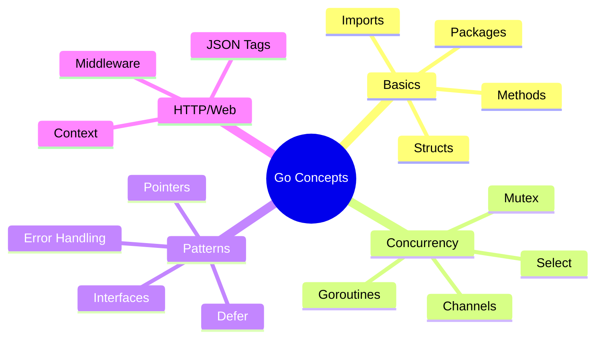

---

# Part 2: Software Engineering Principles

> 🏗️ **Why is the project structured this way?** This section explains the architectural decisions and design patterns used.

---

## Software Engineering Design Principles

### 1. Clean Architecture (Layered Design)

Our project follows **Clean Architecture** principles, separating code into layers:

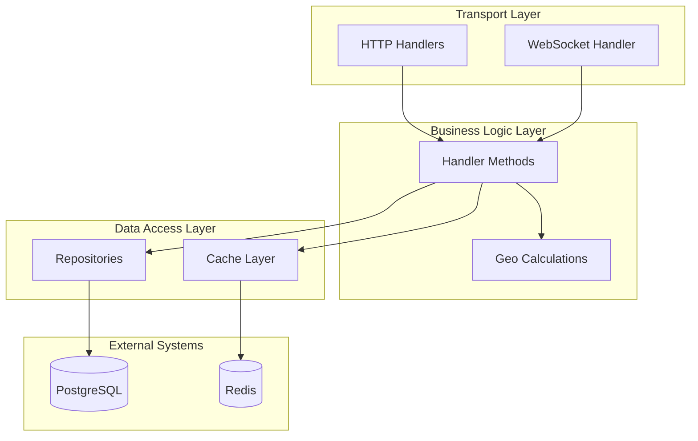

**Why layers?**
| Benefit | Explanation |
|---------|-------------|
| **Testability** | Test handlers without a real database |
| **Flexibility** | Swap PostgreSQL for MySQL without changing handlers |
| **Maintainability** | Changes in one layer don't ripple to others |
| **Understandability** | Clear responsibilities for each component |

### 2. Repository Pattern

The **Repository Pattern** abstracts data access behind a clean interface.

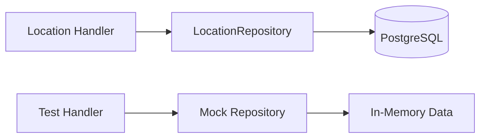

**Without Repository Pattern (bad):**
```go
func (h *Handler) IngestLocation(c echo.Context) error {
    // Database code directly in handler - tightly coupled!
    query := `INSERT INTO location_history ...`
    _, err := h.db.Exec(ctx, query, loc.Lat, loc.Lng)
    return err
}
```

**With Repository Pattern (good):**
```go
// Repository handles database details
type LocationRepository struct {
    db *pgxpool.Pool
}

func (r *LocationRepository) Insert(ctx context.Context, loc *Location) error {
    query := `INSERT INTO location_history ...`
    _, err := r.db.Exec(ctx, query, loc.Lat, loc.Lng)
    return err
}

// Handler doesn't know about database
type Handler struct {
    repo *LocationRepository  // Depends on repository, not database
}

func (h *Handler) IngestLocation(c echo.Context) error {
    return h.repo.Insert(ctx, &loc)  // Clean and simple
}
```

**Why this is better:**
- Handler doesn't know SQL - it just calls `Insert()`
- To test handler, create a fake repository that returns test data
- To change database, only modify the repository

### 3. Dependency Injection

**Dependency Injection** means passing dependencies into components rather than creating them inside.

**Without DI (bad):**
```go
type LocationHandler struct {}

func (h *LocationHandler) IngestLocation(c echo.Context) error {
    // Creates its own dependencies - hard to test!
    db := database.Connect("localhost:5432")  
    repo := database.NewLocationRepository(db)
    return repo.Insert(ctx, &loc)
}
```

**With DI (good):**
```go
type LocationHandler struct {
    repo  *database.LocationRepository  // Injected
    cache *cache.DeviceCache            // Injected
    hub   *hub.Hub                      // Injected
}

// Constructor receives dependencies
func NewLocationHandler(
    repo *database.LocationRepository,
    cache *cache.DeviceCache,
    hub *hub.Hub,
) *LocationHandler {
    return &LocationHandler{repo: repo, cache: cache, hub: hub}
}

func (h *LocationHandler) IngestLocation(c echo.Context) error {
    return h.repo.Insert(ctx, &loc)  // Uses injected dependency
}
```

**In main.go (wiring):**
```go
// All dependencies created and injected at startup
dbPool := database.New(cfg)
locRepo := database.NewLocationRepository(dbPool)
deviceCache := cache.NewDeviceCache(redisClient)
wsHub := hub.New()

locHandler := handlers.NewLocationHandler(locRepo, deviceCache, wsHub)  // Inject!
```

**Benefits:**
| Benefit | Explanation |
|---------|-------------|
| **Testability** | Pass mock dependencies in tests |
| **Visibility** | main.go shows all dependencies clearly |
| **Flexibility** | Easy to swap implementations |
| **Single Responsibility** | Components don't create their own deps |

### 4. Actor Pattern (Single Writer)

The Hub uses the **Actor Pattern** for concurrent state management:

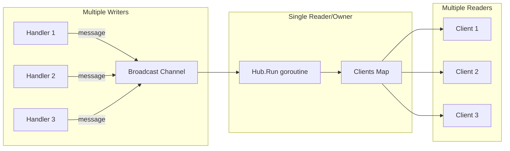

**Problem without Actor Pattern:**
```go
// Multiple goroutines accessing shared map - RACE CONDITION!
hub.Clients[client] = true   // Goroutine 1 writing
for c := range hub.Clients { // Goroutine 2 reading
    // CRASH! Concurrent map read/write
}
```

**Solution with Actor Pattern:**
```go
// Single goroutine owns the map
func (h *Hub) Run() {
    for {
        select {
        case client := <-h.Register:
            h.Clients[client] = true  // Only Run() touches the map
        case msg := <-h.Broadcast:
            for c := range h.Clients {
                c.Send <- msg  // Only Run() iterates the map
            }
        }
    }
}

// Other goroutines send to channels
h.Register <- newClient    // Handler goroutine
h.Broadcast <- message     // Handler goroutine
```

**Why this works:**
- Only `Run()` goroutine accesses `Clients` map directly
- Other goroutines communicate through channels
- No locks needed (channels handle synchronization)
- No race conditions possible

### 5. Why `internal/` vs `pkg/` Directories?

```
transit-backend/
├── internal/        ← Private code (cannot be imported by other projects)
│   ├── handlers/
│   ├── database/
│   └── ...
├── pkg/             ← Public code (can be imported by other projects)
│   └── geo/
```

**`internal/` (Private):**
- Go **enforces** that code in `internal/` cannot be imported from outside the project
- Used for: handlers, database, cache, hub, middleware, models, config
- Gives freedom to refactor without breaking external users

**`pkg/` (Public):**
- Can be imported by other projects
- Used for: geo utilities (could be useful elsewhere)
- Should have stable, well-documented APIs

### 6. Why `cmd/server/main.go`?

Standard Go project layout:
```
cmd/
├── server/          ← Runnable application
│   └── main.go
├── worker/          ← Another runnable application (if needed)
│   └── main.go
└── cli/             ← CLI tool (if needed)
    └── main.go
```

**Benefits:**
- Single repo can contain multiple executables
- Each `main.go` is independent
- Clear separation between library code and executables

### 7. Middleware Chain Pattern

HTTP middleware wraps handlers to add cross-cutting concerns:

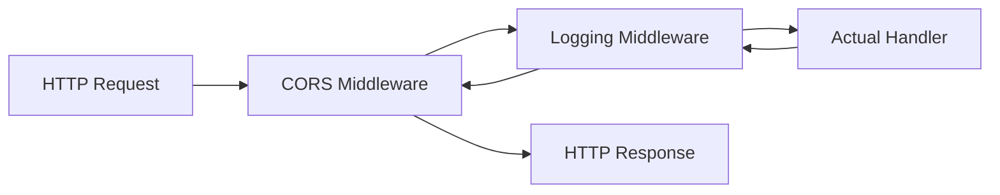

**How it works:**
```go
// Middleware is a function that wraps a handler
func Logging(next echo.HandlerFunc) echo.HandlerFunc {
    return func(c echo.Context) error {
        start := time.Now()
        
        err := next(c)  // Call the wrapped handler
        
        latency := time.Since(start)
        log.Printf("Request took %v", latency)
        
        return err
    }
}

// Apply middleware in order
e.Use(middleware.CORS())    // First (outermost)
e.Use(middleware.Logging)   // Second
// Handler is called last (innermost)
```

**Benefits:**
- **Separation of Concerns**: Logging, auth, CORS are separate from business logic
- **Reusability**: Same middleware for all routes
- **Order Matters**: Request flows through middleware in order applied

### 8. Constructor Functions (`New*`)

Go convention: use `New` functions to create instances:

```go
// Constructor function
func NewLocationHandler(repo *LocationRepository, cache *DeviceCache, hub *Hub) *LocationHandler {
    return &LocationHandler{
        repo:  repo,
        cache: cache,
        hub:   hub,
    }
}

// Usage
handler := handlers.NewLocationHandler(repo, cache, hub)
```

**Why not just create directly?**
```go
// This works but has issues:
handler := &LocationHandler{repo: repo}  // Easy to forget dependencies!
```

**Benefits of constructors:**
- **Validation**: Can check that all required dependencies are provided
- **Defaults**: Can set default values for optional fields
- **Encapsulation**: Hide internal struct fields if needed
- **Documentation**: Function signature shows required dependencies

### 9. Project Naming Conventions

| Convention | Example | Meaning |
|------------|---------|---------|
| **CamelCase exports** | `LocationHandler` | Exported (public) |
| **camelCase internal** | `locationHandler` | Unexported (private) |
| **Package name lowercase** | `package handlers` | Standard Go convention |
| **File matches content** | `location.go` | Contains Location-related code |
| **`*_test.go`** | `distance_test.go` | Test files (auto-detected by `go test`) |

### 10. Error Wrapping Pattern

When errors propagate through layers, we add context:

```go
// In repository layer
func (r *LocationRepository) Insert(ctx context.Context, loc *Location) error {
    _, err := r.db.Exec(ctx, query, ...)
    if err != nil {
        return fmt.Errorf("insert location: %w", err)  // Wrap with context
    }
    return nil
}

// In handler layer
func (h *Handler) IngestLocation(c echo.Context) error {
    if err := h.repo.Insert(ctx, &loc); err != nil {
        return fmt.Errorf("ingest location for device %s: %w", loc.DeviceID, err)
    }
    return nil
}

// Final error might be:
// "ingest location for device bus-001: insert location: connection refused"
```

**Benefits:**
- **Debugging**: Full context of what failed
- **Unwrapping**: Can check specific error types with `errors.Is()` / `errors.As()`

---

## Design Decisions Summary

| Decision | Why |
|----------|-----|
| Go language | High concurrency, fast compilation, simple deployment |
| Echo framework | Minimal, fast, good middleware support |
| pgx driver | Fastest pure Go PostgreSQL driver |
| Redis for caching | Sub-millisecond latency, TTL support |
| TimescaleDB | Optimized for time-series location data |
| WebSocket Hub | Real-time updates without polling |
| Actor pattern | Safe concurrent access without complex locks |
| Repository pattern | Decouple handlers from database |
| Dependency injection | Testable, flexible, visible dependencies |
| `internal/` packages | Prevent accidental external usage |

---

# Part 3: Component Documentation

> 📁 **Detailed breakdown of each file in the project**

---


---

## System Overview

The LatitudeX backend is a **real-time transit tracking system** designed to:
- Ingest GPS location updates from buses/vehicles
- Store location history in a time-series database (TimescaleDB)
- Cache device states for fast reads (Redis)
- Broadcast real-time updates to connected clients (WebSocket)
- Provide REST APIs for routes, stops, and ETA calculations

The architecture follows a **Clean Architecture** pattern with clear separation between:
- **Transport Layer** (HTTP handlers, WebSocket)
- **Business Logic** (Use cases, domain logic)
- **Data Access** (Repositories, cache stores)

---

## Repository Structure

```
transit-backend/
├── cmd/server/main.go        # Application entry point
├── internal/                 # Private application code
│   ├── cache/                # Redis caching layer
│   ├── config/               # Configuration management
│   ├── database/             # Database repositories
│   ├── handlers/             # HTTP/WebSocket handlers
│   ├── hub/                  # WebSocket Pub/Sub hub
│   ├── middleware/           # HTTP middleware
│   └── models/               # Domain models
├── migrations/               # SQL migration scripts
├── pkg/geo/                  # Shared geo utilities
├── public/                   # Static files
├── docs/                     # Documentation
├── Dockerfile
├── Makefile
└── go.mod
```

---

## Core Go Backend (`transit-backend/`)

### Entry Point: [cmd/server/main.go](file:///Users/pratyushsinha/Project/LatitudeX/LatitudeX.backend/transit-backend/cmd/server/main.go)

#### What It Does
The main entry point orchestrates the entire application startup sequence. It acts as the **composition root** where all dependencies are wired together using **dependency injection**.

#### How It Works Internally
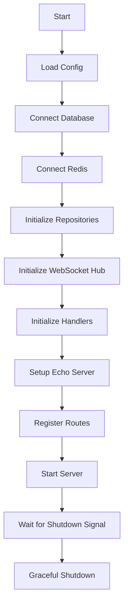

**Startup Sequence (Lines 21-95):**

| Step | Action | Purpose |
|------|--------|---------|
| 1 | `config.LoadConfig()` | Load environment variables |
| 2 | `database.New(cfg)` | Create PostgreSQL connection pool |
| 3 | `cache.New(cfg)` | Create Redis client |
| 4 | `database.New*Repository()` | Initialize all data access layers |
| 5 | `cache.NewDeviceCache()` | Initialize cache wrapper |
| 6 | `hub.New()` + `go wsHub.Run()` | Start WebSocket hub in background goroutine |
| 7 | `handlers.New*Handler()` | Initialize all HTTP handlers with dependencies |
| 8 | `echo.New()` | Create Echo HTTP framework instance |
| 9 | Register middleware | CORS, Logging, Error handling |
| 10 | Register routes | Map URL paths to handlers |
| 11 | `e.Start(addr)` | Start HTTP server in goroutine |
| 12 | `signal.Notify(quit, os.Interrupt)` | Listen for SIGINT |
| 13 | `e.Shutdown(ctx)` | Graceful shutdown with 10s timeout |

#### Why It's Placed Here
Following Go's standard project layout:
- `cmd/` contains application entry points
- `server/` is the specific application name
- Keeps the main function minimal - only wiring, no business logic

#### Connections
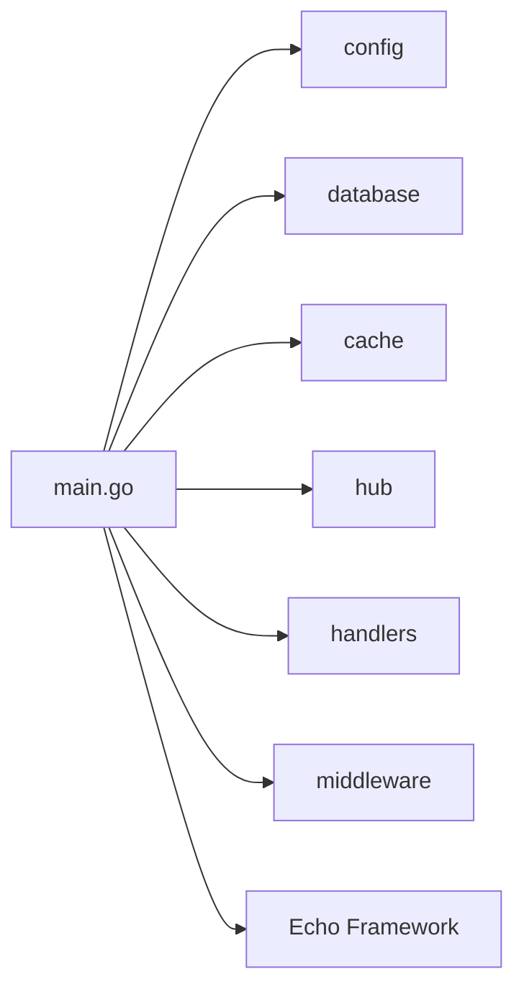

#### Advantages
| Advantage | Explanation |
|-----------|-------------|
| **Dependency Injection** | All components receive their dependencies through constructors, making testing easy |
| **Graceful Shutdown** | Prevents data loss by waiting for in-flight requests to complete |
| **Centralized Wiring** | Single place to understand the entire application structure |
| **Defer Cleanup** | Database and Redis connections are properly closed on exit |

---

### Configuration Layer: [internal/config/](file:///Users/pratyushsinha/Project/LatitudeX/LatitudeX.backend/transit-backend/internal/config)

#### Component: [config.go](file:///Users/pratyushsinha/Project/LatitudeX/LatitudeX.backend/transit-backend/internal/config/config.go)

#### What It Does
Manages application configuration by loading values from environment variables and `.env` files. Implements the **12-Factor App** methodology for configuration.

#### How It Works Internally
```go
type Config struct {
    DBHost, DBPort, DBName, DBUser, DBPassword string  // Database
    RedisHost, RedisPort string                         // Cache
    ServerPort, ServerHost string                       // HTTP Server
    Env, LogLevel string                                // Runtime
}
```

**Loading Process:**
1. Attempt to load `.env` file using `godotenv.Load()` (silent failure if not found)
2. Read each environment variable using `os.Getenv()`
3. Apply default values for optional parameters (e.g., `SERVER_PORT=8080`)
4. Validate required parameters exist
5. Return error if required config is missing

#### Why It's Placed Here
- `internal/` means this package cannot be imported by external projects
- `config/` clearly indicates its purpose
- Centralized configuration prevents scattered `os.Getenv()` calls throughout the codebase

#### Connections
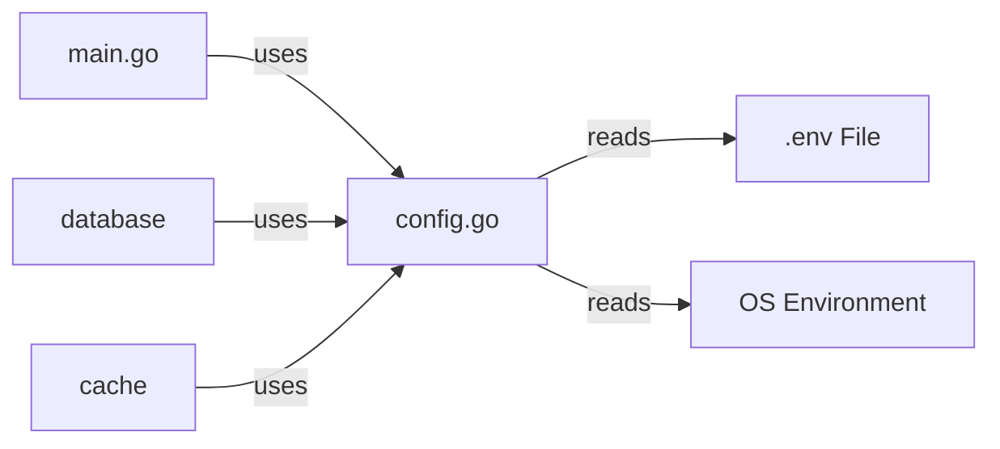

#### Advantages
| Advantage | Explanation |
|-----------|-------------|
| **Environment Agnostic** | Same binary works in dev, staging, and production |
| **Secure Secrets** | Passwords never hardcoded, loaded from env vars |
| **Validation** | Fails fast if required config is missing |
| **Defaults** | Sensible defaults reduce required configuration |
| **Single Source of Truth** | All config defined in one struct |

---

### Database Layer: [internal/database/](file:///Users/pratyushsinha/Project/LatitudeX/LatitudeX.backend/transit-backend/internal/database)

#### Component: [db.go](file:///Users/pratyushsinha/Project/LatitudeX/LatitudeX.backend/transit-backend/internal/database/db.go)

#### What It Does
Creates and configures the PostgreSQL connection pool using `pgx`, the fastest pure Go PostgreSQL driver.

#### How It Works Internally
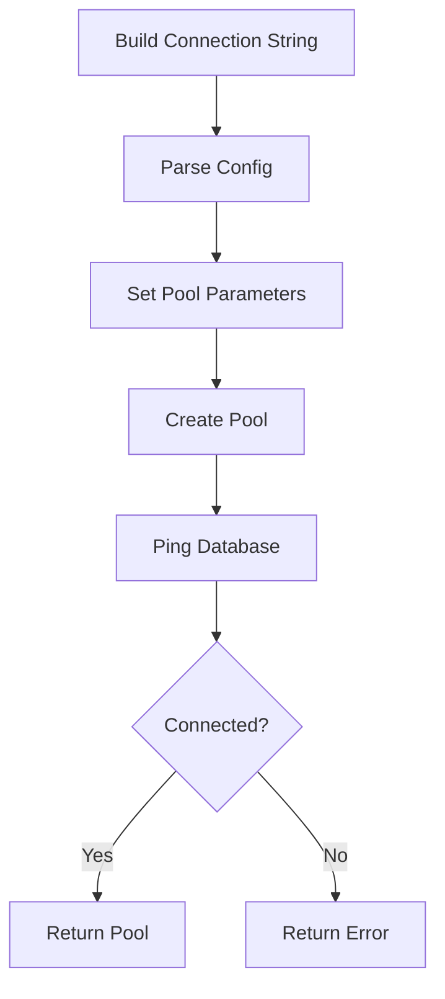

**Pool Configuration:**
```go
poolConfig.MaxConns = 10        // Maximum connections in pool
poolConfig.MinConns = 2         // Keep 2 warm connections
poolConfig.MaxConnLifetime = time.Hour  // Recycle connections hourly
```

#### Why These Settings?
| Setting | Value | Rationale |
|---------|-------|-----------|
| `MaxConns=10` | Moderate limit to prevent overwhelming PostgreSQL (default 100 connections) |
| `MinConns=2` | Avoids cold start latency for initial requests |
| `MaxConnLifetime=1h` | Prevents stale connections after network changes |
| Timeout: 5s | Fail fast during startup if DB is unreachable |

#### Connections
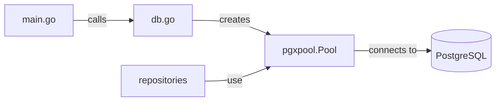

#### Advantages
| Advantage | Explanation |
|-----------|-------------|
| **Connection Pooling** | Reuses connections, avoiding TCP handshake overhead |
| **Concurrent Safe** | Pool handles multiple goroutines safely |
| **Pure Go** | No CGO, simplifies cross-compilation and deployment |
| **Context Support** | All queries respect cancellation/timeout |

---

#### Component: [locations.go](file:///Users/pratyushsinha/Project/LatitudeX/LatitudeX.backend/transit-backend/internal/database/locations.go)

#### What It Does
Repository for inserting GPS location data into the `location_history` hypertable (TimescaleDB).

#### How It Works Internally
```go
type LocationRepository struct {
    db *pgxpool.Pool
}

func (r *LocationRepository) Insert(ctx context.Context, loc *models.Location) error {
    query := `
        INSERT INTO location_history (time, device_id, latitude, longitude, speed, accuracy)
        VALUES ($1, $2, $3, $4, $5, $6)
    `
    // Convert Unix timestamp to time.Time
    ts := time.Unix(loc.Timestamp, 0)
    if loc.Timestamp == 0 {
        ts = time.Now()
    }
    _, err := r.db.Exec(ctx, query, ts, loc.DeviceID, loc.Latitude, loc.Longitude, loc.Speed, loc.Accuracy)
    return err
}
```

#### Why TimescaleDB?
| Feature | Benefit |
|---------|---------|
| **Hypertables** | Auto-partitions data by time for fast range queries |
| **Compression** | Reduces storage costs for historical data |
| **Retention Policies** | Automatically delete old data |
| **Standard SQL** | No learning curve, uses regular PostgreSQL syntax |

#### Connections
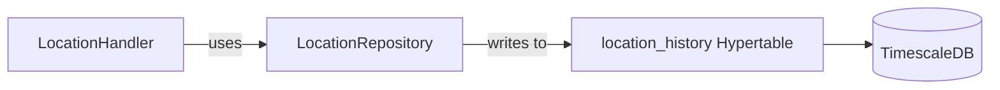

---

#### Component: [routes.go](file:///Users/pratyushsinha/Project/LatitudeX/LatitudeX.backend/transit-backend/internal/database/routes.go)

#### What It Does
Repository for querying transit routes from the `routes` table.

#### How It Works Internally
```go
func (r *RouteRepository) GetAll(ctx context.Context) ([]models.Route, error) {
    query := `SELECT id, name, description FROM routes`
    rows, err := r.db.Query(ctx, query)
    // ... scan rows into []models.Route
}
```

#### Why Separate Repository?
- **Single Responsibility**: Each repository handles one aggregate
- **Testability**: Can mock this repository in handler tests
- **Type Safety**: Returns strongly typed `[]models.Route`

---

#### Component: [stops.go](file:///Users/pratyushsinha/Project/LatitudeX/LatitudeX.backend/transit-backend/internal/database/stops.go)

#### What It Does
Repository for querying bus stops, supporting both route-based and ID-based lookups.

#### How It Works Internally
**Two Query Methods:**

1. `GetByRouteID(ctx, routeID)` - Gets all stops for a route, ordered by sequence
2. `GetByID(ctx, stopID)` - Gets a single stop by ID

**Why Ordered by Sequence?**
```sql
ORDER BY sequence_number
```
This ensures stops are returned in the order buses visit them, critical for:
- Displaying stops in correct order on UI
- Calculating which buses are "before" a stop for arrival predictions

#### Connections
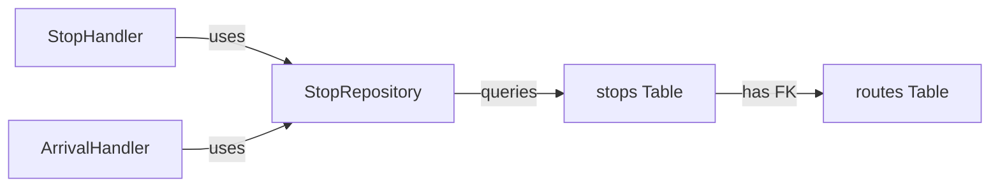

---

#### Component: [trips.go](file:///Users/pratyushsinha/Project/LatitudeX/LatitudeX.backend/transit-backend/internal/database/trips.go)

#### What It Does
Repository for querying active trips with their latest positions using an optimized **LATERAL JOIN**.

#### How It Works Internally
```sql
SELECT 
    t.id, t.device_id, d.name,
    lh.latitude, lh.longitude, lh.speed
FROM trips t
JOIN devices d ON t.device_id = d.id
LEFT JOIN LATERAL (
    SELECT latitude, longitude, speed
    FROM location_history
    WHERE device_id = t.device_id
    ORDER BY time DESC
    LIMIT 1
) lh ON true
WHERE t.status = 'IN_PROGRESS' 
  AND t.current_stop < $1
  AND lh.latitude IS NOT NULL
```

#### Why LATERAL JOIN?
| Alternative | Problem | LATERAL Advantage |
|-------------|---------|-------------------|
| N+1 Queries | 1 query for trips + 1 query per trip = O(N) roundtrips | Single query, O(1) roundtrips |
| Subquery | Cannot reference outer table | Can use `t.device_id` in subquery |
| Window Functions | Complex, requires CTE | Simple, readable |

#### Connections
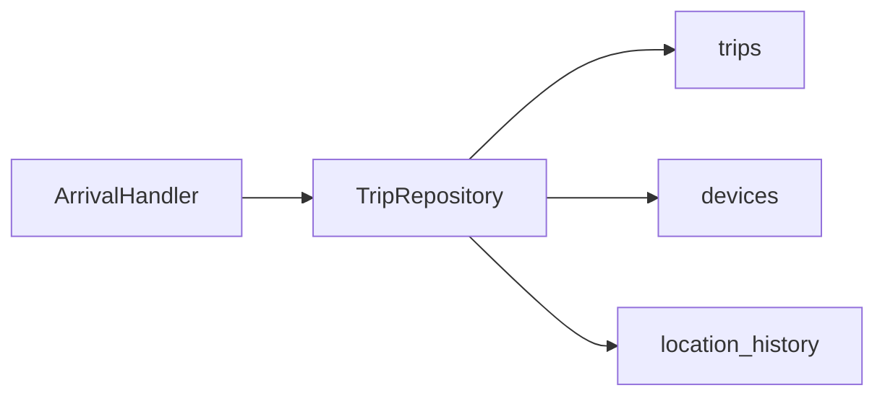

---

### Cache Layer: [internal/cache/](file:///Users/pratyushsinha/Project/LatitudeX/LatitudeX.backend/transit-backend/internal/cache)

#### Component: [redis.go](file:///Users/pratyushsinha/Project/LatitudeX/LatitudeX.backend/transit-backend/internal/cache/redis.go)

#### What It Does
Creates the Redis client connection with health check.

#### How It Works Internally
```go
func New(cfg *config.Config) (*redis.Client, error) {
    rdb := redis.NewClient(&redis.Options{
        Addr:     fmt.Sprintf("%s:%s", cfg.RedisHost, cfg.RedisPort),
        Password: "",    // No password by default
        DB:       0,     // Use default database
    })
    
    // Verify connection with 5s timeout
    ctx, cancel := context.WithTimeout(context.Background(), 5*time.Second)
    defer cancel()
    
    if err := rdb.Ping(ctx).Err(); err != nil {
        return nil, fmt.Errorf("unable to connect to redis: %w", err)
    }
    return rdb, nil
}
```

#### Why Redis?
| Feature | Benefit for Transit Tracking |
|---------|------------------------------|
| **Sub-millisecond Latency** | Real-time position lookups are instant |
| **TTL Support** | Stale device data auto-expires |
| **In-Memory** | No disk I/O for read-heavy workloads |
| **Simple Protocol** | Low overhead per operation |

---

#### Component: [device.go](file:///Users/pratyushsinha/Project/LatitudeX/LatitudeX.backend/transit-backend/internal/cache/device.go)

#### What It Does
Provides a domain-specific wrapper around Redis for caching device (bus) state.

#### How It Works Internally
```go
type DeviceCache struct {
    rdb *redis.Client
}

func (c *DeviceCache) SetDeviceState(ctx context.Context, deviceID string, state map[string]interface{}) error {
    key := fmt.Sprintf("device:%s", deviceID)  // Key pattern: device:bus-001
    data, err := json.Marshal(state)            // Serialize to JSON
    if err != nil {
        return err
    }
    return c.rdb.Set(ctx, key, data, time.Hour).Err()  // Store with 1-hour TTL
}

func (c *DeviceCache) GetDeviceState(ctx context.Context, deviceID string) (map[string]interface{}, error) {
    key := fmt.Sprintf("device:%s", deviceID)
    val, err := c.rdb.Get(ctx, key).Result()
    // ... deserialize JSON
}
```

#### Key Design Decisions
| Decision | Rationale |
|----------|-----------|
| `device:{id}` key pattern | Clear namespace, easy to find/debug |
| JSON serialization | Human-readable, debuggable in Redis CLI |
| 1-hour TTL | Device data considered stale after 1 hour of no updates |
| `map[string]interface{}` | Flexible schema for different telemetry data |

#### Connections
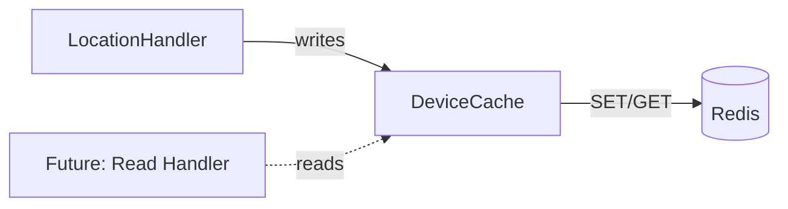

---

### Models Layer: [internal/models/](file:///Users/pratyushsinha/Project/LatitudeX/LatitudeX.backend/transit-backend/internal/models)

The models package defines the domain objects that flow through the system.

#### Component: [device.go](file:///Users/pratyushsinha/Project/LatitudeX/LatitudeX.backend/transit-backend/internal/models/device.go)

```go
type Device struct {
    ID     string `json:"id"`      // Unique identifier (e.g., "bus-001")
    Name   string `json:"name"`    // Display name (e.g., "Bus 42")
    Status string `json:"status"`  // "ACTIVE", "INACTIVE", "MAINTENANCE"
}
```

#### Component: [location.go](file:///Users/pratyushsinha/Project/LatitudeX/LatitudeX.backend/transit-backend/internal/models/location.go)

```go
type Location struct {
    DeviceID  string  `json:"device_id"`   // Which bus
    Latitude  float64 `json:"latitude"`    // GPS latitude
    Longitude float64 `json:"longitude"`   // GPS longitude
    Speed     float64 `json:"speed"`       // Speed in km/h
    Accuracy  float64 `json:"accuracy"`    // GPS accuracy in meters
    Timestamp int64   `json:"timestamp"`   // Unix timestamp
}

type LocationUpdate struct {
    Type      string  `json:"type"`        // Message type for WebSocket
    // ... same fields as Location
}
```

#### Component: [route.go](file:///Users/pratyushsinha/Project/LatitudeX/LatitudeX.backend/transit-backend/internal/models/route.go)

```go
type Route struct {
    ID          string `json:"id"`          // "route-A1"
    Name        string `json:"name"`        // "Downtown Express"
    Description string `json:"description"` // "Main St → Central Station"
}
```

#### Component: [stop.go](file:///Users/pratyushsinha/Project/LatitudeX/LatitudeX.backend/transit-backend/internal/models/stop.go)

```go
type Stop struct {
    ID        string  `json:"id"`        // "stop-001"
    Name      string  `json:"name"`      // "Central Station"
    Latitude  float64 `json:"latitude"`
    Longitude float64 `json:"longitude"`
    Sequence  int     `json:"sequence"`  // Order in the route
}
```

#### Component: [trip.go](file:///Users/pratyushsinha/Project/LatitudeX/LatitudeX.backend/transit-backend/internal/models/trip.go)

```go
type Trip struct {
    ID          string `json:"id"`           // "trip-20231213-001"
    RouteID     string `json:"route_id"`     // "route-A1"
    DeviceID    string `json:"device_id"`    // "bus-001"
    CurrentStop int    `json:"current_stop"` // Which stop the bus is currently at
    Status      string `json:"status"`       // "IN_PROGRESS", "COMPLETED"
}

type ArrivalEvent struct {
    TripID     string `json:"trip_id"`
    DeviceID   string `json:"device_id"`
    DeviceName string `json:"device_name"`
    ETAMinutes int    `json:"eta_minutes"`  // Estimated arrival time
}
```

#### Why Separate Models Package?
| Advantage | Explanation |
|-----------|-------------|
| **Decoupling** | Handlers don't depend on database internals |
| **Serialization** | JSON tags defined once |
| **Validation** | Single place to add validation logic |
| **Documentation** | Clear domain language for team |

---

### Handler Layer: [internal/handlers/](file:///Users/pratyushsinha/Project/LatitudeX/LatitudeX.backend/transit-backend/internal/handlers)

#### Component: [location.go](file:///Users/pratyushsinha/Project/LatitudeX/LatitudeX.backend/transit-backend/internal/handlers/location.go)

#### What It Does
Handles GPS location ingestion from devices. This is the **hot path** - called every few seconds per bus.

#### How It Works Internally (Critical Path Analysis)
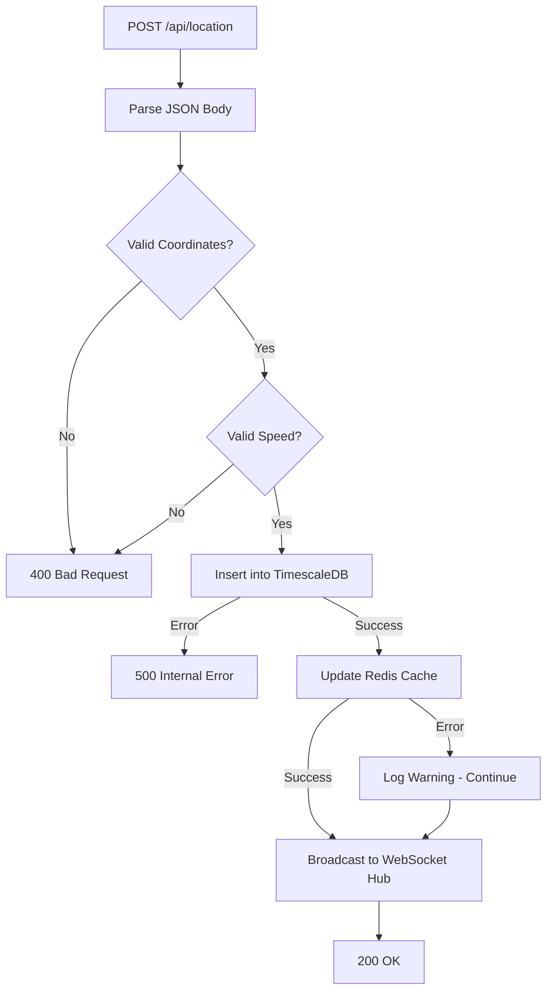

**Validation Rules:**
```go
if loc.Latitude < -90 || loc.Latitude > 90 || loc.Longitude < -180 || loc.Longitude > 180 {
    return 400 // Invalid coordinates
}
if loc.Speed < 0 || loc.Speed > 350 {
    return 400 // Speed out of range (0-350 km/h)
}
```

**Non-Blocking Broadcast:**
```go
select {
case h.hub.Broadcast <- msg:
    // Sent successfully
default:
    // Buffer full, drop message to avoid blocking
}
```

#### Why These Design Choices?
| Decision | Rationale |
|----------|-----------|
| Validate first | Reject bad data before touching DB |
| DB insert before cache | Data safety > cache freshness |
| Cache failure = warning | Non-critical, don't fail request |
| Non-blocking broadcast | One slow client shouldn't affect ingestion |

---

#### Component: [routes.go](file:///Users/pratyushsinha/Project/LatitudeX/LatitudeX.backend/transit-backend/internal/handlers/routes.go)

#### What It Does
Simple handler to list all transit routes.

```go
func (h *RouteHandler) GetRoutes(c echo.Context) error {
    routes, err := h.repo.GetAll(c.Request().Context())
    if err != nil {
        c.Logger().Error(err)
        return c.JSON(http.StatusInternalServerError, map[string]string{"error": "internal error"})
    }
    return c.JSON(http.StatusOK, routes)
}
```

---

#### Component: [stops.go](file:///Users/pratyushsinha/Project/LatitudeX/LatitudeX.backend/transit-backend/internal/handlers/stops.go)

#### What It Does
Returns all stops for a given route.

**Required Query Parameter:** `route_id`

```
GET /api/stops?route_id=route-A1
```

---

#### Component: [arrivals.go](file:///Users/pratyushsinha/Project/LatitudeX/LatitudeX.backend/transit-backend/internal/handlers/arrivals.go)

#### What It Does
Calculates real-time arrival predictions for a specific stop.

#### How It Works Internally
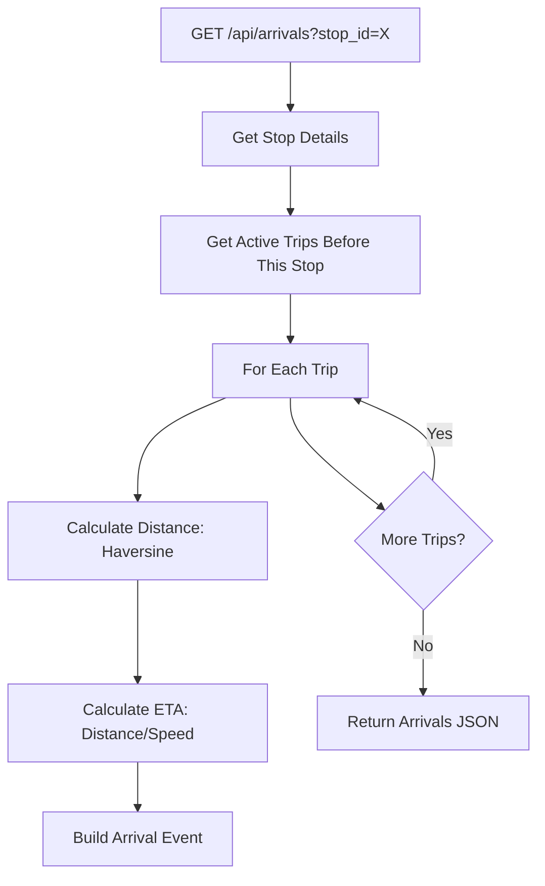

**ETA Calculation:**
```go
eta := geo.CalculateETA(trip.Latitude, trip.Longitude, targetStop.Latitude, targetStop.Longitude, trip.Speed)
```

#### Why This Approach?
| Approach | Alternative | Why Chosen |
|----------|-------------|------------|
| Haversine distance | Google Maps API | No external dependency, works offline |
| Simple ETA (distance/speed) | ML prediction | Simple, explainable, good enough for MVP |
| Default speed if stopped | Zero causes division by zero | Handle parked buses gracefully |

---

#### Component: [websocket.go](file:///Users/pratyushsinha/Project/LatitudeX/LatitudeX.backend/transit-backend/internal/handlers/websocket.go)

#### What It Does
Upgrades HTTP connections to WebSocket and registers clients with the hub.

#### How It Works Internally
```go
func (h *WebSocketHandler) HandleWS(c echo.Context) error {
    // 1. Upgrade HTTP to WebSocket
    conn, err := upgrader.Upgrade(c.Response(), c.Request(), nil)
    if err != nil {
        return err
    }
    
    // 2. Create client with buffered send channel
    client := &hub.Client{Hub: h.hub, Conn: conn, Send: make(chan interface{}, 256)}
    
    // 3. Register with hub
    client.Hub.Register <- client
    
    // 4. Start goroutines for reading/writing
    go client.WritePump()
    go client.ReadPump()
    
    return nil
}
```

**Upgrader Configuration:**
```go
var upgrader = websocket.Upgrader{
    ReadBufferSize:  1024,
    WriteBufferSize: 1024,
    CheckOrigin: func(r *http.Request) bool {
        return true  // Allow all origins (for development)
    },
}
```

---

### WebSocket Hub: [internal/hub/](file:///Users/pratyushsinha/Project/LatitudeX/LatitudeX.backend/transit-backend/internal/hub)

This is the **real-time broadcasting engine** of the system.

#### Component: [hub.go](file:///Users/pratyushsinha/Project/LatitudeX/LatitudeX.backend/transit-backend/internal/hub/hub.go)

#### What It Does
Central pub/sub system that manages WebSocket clients and broadcasts messages.

#### How It Works Internally
```go
type Hub struct {
    Clients    map[*Client]bool    // Set of connected clients
    Broadcast  chan interface{}    // Incoming messages to broadcast
    Register   chan *Client        // Register requests
    Unregister chan *Client        // Unregister requests
    mu         sync.RWMutex        // Protects Clients map
}
```

**The Run Loop (Actor Pattern):**
```go
func (h *Hub) Run() {
    for {
        select {
        case client := <-h.Register:
            h.mu.Lock()
            h.Clients[client] = true
            h.mu.Unlock()
            
        case client := <-h.Unregister:
            h.mu.Lock()
            if _, ok := h.Clients[client]; ok {
                delete(h.Clients, client)
                close(client.Send)  // Signal WritePump to exit
            }
            h.mu.Unlock()
            
        case message := <-h.Broadcast:
            h.mu.RLock()
            for client := range h.Clients {
                select {
                case client.Send <- message:
                    // Sent successfully
                default:
                    // Buffer full, skip this client
                }
            }
            h.mu.RUnlock()
        }
    }
}
```

#### Why Actor Pattern?
| Advantage | Explanation |
|-----------|-------------|
| **No Deadlocks** | Single goroutine owns the state |
| **Simple Reasoning** | Operations happen sequentially |
| **High Throughput** | Channels enable async communication |

#### Buffer Sizes
| Channel | Size | Rationale |
|---------|------|-----------|
| `Broadcast` | 256 | Handle bursts without blocking senders |
| `client.Send` | 256 | Buffer before writing to socket |
| `Register` | Unbuffered | Connection setup can wait |
| `Unregister` | Unbuffered | Cleanup can wait |

---

#### Component: [client.go](file:///Users/pratyushsinha/Project/LatitudeX/LatitudeX.backend/transit-backend/internal/hub/client.go)

#### What It Does
Represents a single WebSocket connection with its own goroutines for reading and writing.

#### How It Works Internally
**Two Goroutines Per Client:**

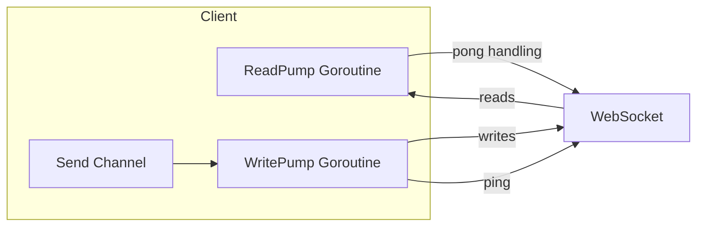

**ReadPump (Lines 43-60):**
- Sets read deadline (60s)
- Handles pong messages (extends deadline)
- Detects disconnection
- Unregisters client on exit

**WritePump (Lines 66-93):**
- Listens on `Send` channel
- Writes JSON to socket
- Sends periodic pings (every 54s)
- Closes connection on error

#### Timing Constants
```go
const (
    writeWait  = 10 * time.Second   // Max time to write a message
    pongWait   = 60 * time.Second   // Expect pong within 60s
    pingPeriod = 54 * time.Second   // Send ping every 54s (< 60s)
    maxMessageSize = 512            // Ignore large messages
)
```

#### Why Separate Read/Write Goroutines?
| Reason | Explanation |
|--------|-------------|
| **Concurrent I/O** | Read and write can happen simultaneously |
| **Non-Blocking** | Slow writes don't block reads |
| **WebSocket Spec** | Only one reader and one writer per connection |

---

#### Component: [message.go](file:///Users/pratyushsinha/Project/LatitudeX/LatitudeX.backend/transit-backend/internal/hub/message.go)

#### What It Does
Defines the structure of messages sent over WebSocket.

```go
type Message struct {
    Type      string      `json:"type"`               // e.g., "LOCATION_UPDATE"
    Payload   interface{} `json:"payload,omitempty"`  // Optional additional data
    DeviceID  string      `json:"device_id,omitempty"`
    Latitude  float64     `json:"latitude,omitempty"`
    Longitude float64     `json:"longitude,omitempty"`
    Speed     float64     `json:"speed,omitempty"`
    Accuracy  float64     `json:"accuracy,omitempty"`
    Timestamp int64       `json:"timestamp,omitempty"`
}

const MsgTypeLocationUpdate = "LOCATION_UPDATE"
```

---

### Middleware Layer: [internal/middleware/](file:///Users/pratyushsinha/Project/LatitudeX/LatitudeX.backend/transit-backend/internal/middleware)

#### Component: [cors.go](file:///Users/pratyushsinha/Project/LatitudeX/LatitudeX.backend/transit-backend/internal/middleware/cors.go)

#### What It Does
Enables Cross-Origin Resource Sharing for browser-based clients.

```go
func CORS() echo.MiddlewareFunc {
    return middleware.CORSWithConfig(middleware.CORSConfig{
        AllowOrigins: []string{"*"},                                    // All origins
        AllowMethods: []string{echo.GET, echo.POST, echo.OPTIONS},      // Limited methods
        AllowHeaders: []string{echo.HeaderContentType},                 // Limited headers
    })
}
```

#### Why This Configuration?
| Setting | Value | Reason |
|---------|-------|--------|
| `AllowOrigins: *` | Development convenience | Should be restricted in production |
| `AllowMethods` | GET, POST, OPTIONS | Only methods used by API |
| `AllowHeaders` | Content-Type | Required for JSON requests |

---

#### Component: [errors.go](file:///Users/pratyushsinha/Project/LatitudeX/LatitudeX.backend/transit-backend/internal/middleware/errors.go)

#### What It Does
Custom HTTP error handler that returns consistent JSON error responses.

```go
func HTTPErrorHandler(err error, c echo.Context) {
    code := http.StatusInternalServerError
    message := "Internal Server Error"
    
    if he, ok := err.(*echo.HTTPError); ok {
        code = he.Code
        message = result(he.Message)  // Extract string message
    }
    
    c.Logger().Error(err)
    _ = c.JSON(code, map[string]string{"error": message})
}
```

#### Why Custom Handler?
- **Consistent Format**: All errors return `{"error": "message"}`
- **Logging**: All errors are logged
- **Type Safety**: Handles Echo's HTTPError type properly

---

#### Component: [logging.go](file:///Users/pratyushsinha/Project/LatitudeX/LatitudeX.backend/transit-backend/internal/middleware/logging.go)

#### What It Does
Logs every HTTP request with method, path, status, and latency.

```go
func Logging(next echo.HandlerFunc) echo.HandlerFunc {
    return func(c echo.Context) error {
        start := time.Now()
        
        err := next(c)          // Call the actual handler
        if err != nil {
            c.Error(err)
        }
        
        latency := time.Since(start)
        
        log.Printf(`{"method":"%s","path":"%s","status":%d,"latency_ms":%d}`,
            req.Method, req.URL.Path, res.Status, latency.Milliseconds())
        
        return err
    }
}
```

#### Why JSON Format?
| Advantage | Explanation |
|-----------|-------------|
| **Structured Logs** | Easy to parse with log aggregators |
| **Searchable** | Query by method, path, status, etc. |
| **Metrics** | Extract latency for monitoring |

---

### Geo Utilities: [pkg/geo/](file:///Users/pratyushsinha/Project/LatitudeX/LatitudeX.backend/transit-backend/pkg/geo)

> Note: `pkg/` directory means this code can be imported by external projects.

#### Component: [distance.go](file:///Users/pratyushsinha/Project/LatitudeX/LatitudeX.backend/transit-backend/pkg/geo/distance.go)

#### What It Does
Provides geographic calculations for distance and ETA estimation.

#### How It Works Internally

**1. Haversine Formula (Great-Circle Distance)**
```go
func Haversine(lat1, lng1, lat2, lng2 float64) float64 {
    dLat := (lat2 - lat1) * (math.Pi / 180.0)
    dLng := (lng2 - lng1) * (math.Pi / 180.0)
    
    lat1Rad := lat1 * (math.Pi / 180.0)
    lat2Rad := lat2 * (math.Pi / 180.0)
    
    a := math.Sin(dLat/2)*math.Sin(dLat/2) +
        math.Sin(dLng/2)*math.Sin(dLng/2)*math.Cos(lat1Rad)*math.Cos(lat2Rad)
    c := 2 * math.Atan2(math.Sqrt(a), math.Sqrt(1-a))
    
    return EarthRadiusKm * c  // 6371 km
}
```

**Why Haversine?**
| Alternative | Problem |
|-------------|---------|
| Euclidean distance | Ignores Earth's curvature |
| Vincenty formula | More accurate but slower |
| External API | Network dependency, cost |

**2. ETA Calculation**
```go
func CalculateETA(fromLat, fromLng, toLat, toLng, speedKmh float64) int {
    distanceKm := Haversine(fromLat, fromLng, toLat, toLng)
    
    effectiveSpeed := speedKmh
    if effectiveSpeed < MinSpeedKmh {  // < 1 km/h
        effectiveSpeed = DefaultSpeed   // Use 20 km/h
    }
    
    timeHours := distanceKm / effectiveSpeed
    return int(math.Round(timeHours * 60))  // Convert to minutes
}
```

**Constants:**
```go
const (
    EarthRadiusKm = 6371.0  // Mean Earth radius
    MinSpeedKmh   = 1.0     // Below this, use default
    DefaultSpeed  = 20.0    // Assumed speed for stopped vehicles
)
```

---

#### Component: [distance_test.go](file:///Users/pratyushsinha/Project/LatitudeX/LatitudeX.backend/transit-backend/pkg/geo/distance_test.go)

#### What It Does
Unit tests for geographic calculations.

**Test Cases:**
1. **Haversine**: New York to London ≈ 5570 km
2. **ETA**: 111 km at 111 km/h ≈ 60 minutes
3. **Default Speed**: Uses 20 km/h when speed < 1 km/h

---

### Database Migrations: [migrations/](file:///Users/pratyushsinha/Project/LatitudeX/LatitudeX.backend/transit-backend/migrations)

#### Component: [001_create_tables.sql](file:///Users/pratyushsinha/Project/LatitudeX/LatitudeX.backend/transit-backend/migrations/001_create_tables.sql)

#### What It Does
Creates the initial database schema.

```sql
-- Enable extensions
CREATE EXTENSION IF NOT EXISTS timescaledb;
CREATE EXTENSION IF NOT EXISTS postgis;

-- Tables
CREATE TABLE devices (...);
CREATE TABLE routes (...);
CREATE TABLE stops (...);
CREATE TABLE location_history (...);
CREATE TABLE trips (...);

-- Convert to hypertable
SELECT create_hypertable('location_history', 'time', if_not_exists => TRUE);
```

#### Table Overview
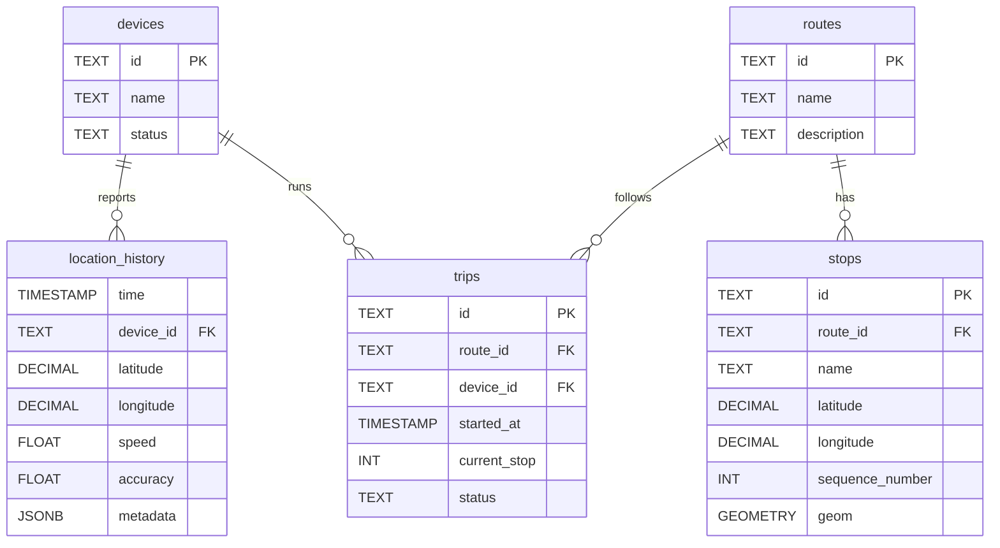

---

#### Component: [002_add_indexes.sql](file:///Users/pratyushsinha/Project/LatitudeX/LatitudeX.backend/transit-backend/migrations/002_add_indexes.sql)

#### What It Does
Adds performance-critical indexes.

```sql
-- Spatial index for stops (find nearby stops)
CREATE INDEX idx_stops_geom ON stops USING GIST(geom);

-- Time-series index for location history (latest position lookup)
CREATE INDEX idx_location_history_device_time ON location_history (device_id, time DESC);
```

#### Why These Indexes?
| Index | Query It Optimizes |
|-------|-------------------|
| `idx_stops_geom` (GIST) | `SELECT * FROM stops WHERE ST_DWithin(geom, point, radius)` |
| `idx_location_history_device_time` | `SELECT * FROM location_history WHERE device_id = X ORDER BY time DESC LIMIT 1` |

---

## Component Relationships Diagram

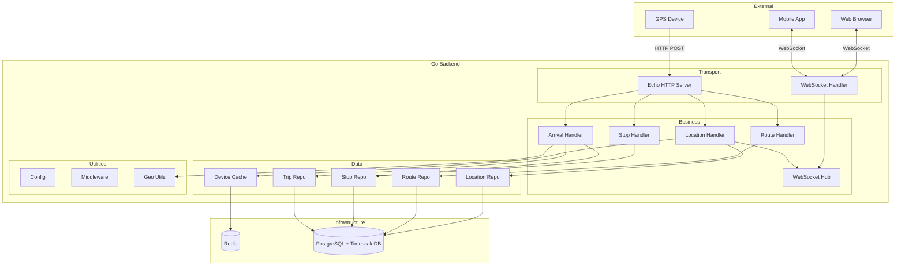

---

## Data Flow Diagrams

### Location Ingestion Flow
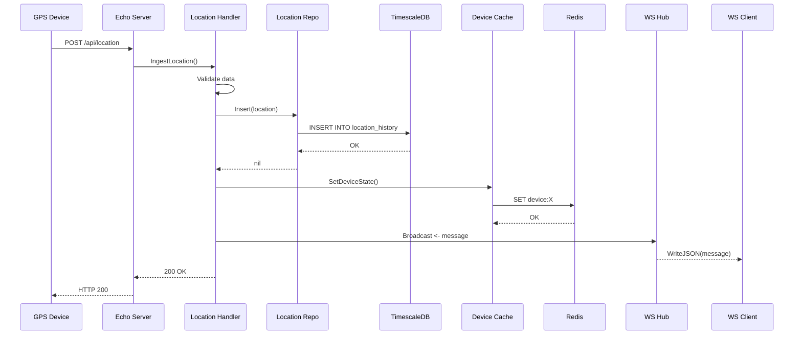

### Arrival Prediction Flow
```mermaid
sequenceDiagram
    participant Client as Mobile App
    participant Echo as Echo Server
    participant AH as Arrival Handler
    participant SR as Stop Repo
    participant TR as Trip Repo
    participant Geo as Geo Utils
    participant DB as PostgreSQL
    
    Client->>Echo: GET /api/arrivals?stop_id=X
    Echo->>AH: GetArrivals()
    AH->>SR: GetByID(stop_id)
    SR->>DB: SELECT * FROM stops WHERE id = X
    DB-->>SR: Stop data
    SR-->>AH: Stop
    AH->>TR: GetActiveTripsBeforeStop(sequence)
    TR->>DB: SELECT with LATERAL JOIN
    DB-->>TR: Trips with locations
    TR-->>AH: []TripWithLocation
    loop For each trip
        AH->>Geo: CalculateETA(trip, stop)
        Geo-->>AH: ETA in minutes
    end
    AH-->>Echo: []ArrivalEvent
    Echo-->>Client: JSON response
```

---

## Summary Table

| Component | Location | Purpose | Connects To | Key Advantage |
|-----------|----------|---------|-------------|---------------|
| **main.go** | `cmd/server/` | Application entry point | All components | Dependency injection |
| **config.go** | `internal/config/` | Configuration management | Environment vars | 12-factor app compliance |
| **db.go** | `internal/database/` | Connection pool | PostgreSQL | Connection reuse |
| **locations.go** | `internal/database/` | Location persistence | TimescaleDB | Hypertable writes |
| **routes.go** | `internal/database/` | Route queries | PostgreSQL | Simple CRUD |
| **stops.go** | `internal/database/` | Stop queries | PostgreSQL | Ordered by sequence |
| **trips.go** | `internal/database/` | Trip + location queries | PostgreSQL | LATERAL JOIN optimization |
| **redis.go** | `internal/cache/` | Redis connection | Redis | Fast caching |
| **device.go** | `internal/cache/` | Device state caching | Redis | TTL-based expiry |
| **location.go** | `internal/handlers/` | GPS ingestion | DB, Cache, Hub | Hot path optimization |
| **routes.go** | `internal/handlers/` | List routes | RouteRepo | Simple handler |
| **stops.go** | `internal/handlers/` | List stops | StopRepo | Route filtering |
| **arrivals.go** | `internal/handlers/` | ETA calculation | StopRepo, TripRepo, Geo | Real-time prediction |
| **websocket.go** | `internal/handlers/` | WS upgrade | Hub | Connection management |
| **hub.go** | `internal/hub/` | Pub/sub engine | Clients | Actor pattern |
| **client.go** | `internal/hub/` | Connection handler | WebSocket | Bidirectional pumps |
| **message.go** | `internal/hub/` | Message structure | N/A | Type safety |
| **cors.go** | `internal/middleware/` | CORS headers | Echo | Browser compatibility |
| **errors.go** | `internal/middleware/` | Error handling | Echo | Consistent responses |
| **logging.go** | `internal/middleware/` | Request logging | Echo | Observability |
| **distance.go** | `pkg/geo/` | Distance/ETA math | N/A | No external deps |
| **001_create_tables.sql** | `migrations/` | Schema creation | PostgreSQL | Database setup |
| **002_add_indexes.sql** | `migrations/` | Performance indexes | PostgreSQL | Query optimization |

---

> **Document Version:** 1.0  
> **Generated:** 2025-12-13  
> **Repository:** LatitudeX.backend
