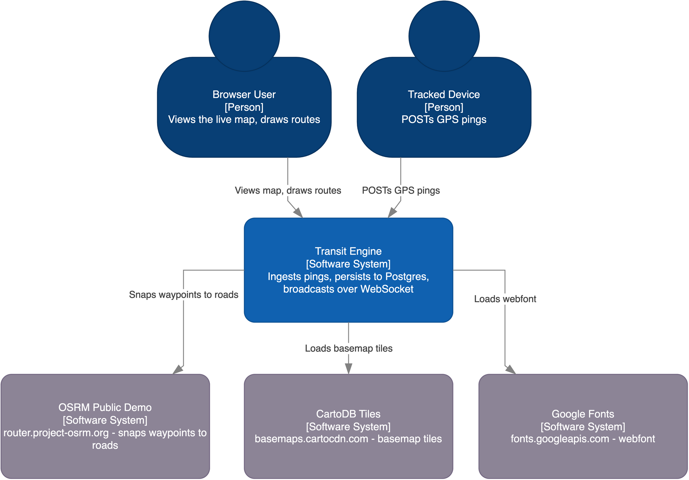

# 01-what-is-this.md — What is this, in plain English

*Written from `docs/explain/00-inventory.md` (the repository inventory) alone. Not derived
from `CLAUDE.md`'s own framing of the project — the facts below are read off the routes, the
database schema, and the code, and the framing follows from those facts.*

---

## The short version

This is a server that receives a stream of GPS coordinates from moving things — each single
report is a **ping** — remembers where each one is, figures out when one is near a place
someone cares about, and pushes live position updates out to a map in a web browser as they
happen.

That's it. There is a demo web page built on top of it that draws little bus icons on a map
of a city, because "buses on a map" is an easy scenario to picture — but nothing about the
underlying system is specific to buses. The database calls the moving things "devices"; the
places they're tracked against are "stops"; a scheduled run between them is a "trip"
(inventory §4.1, §4.3, §4.5). Swap the seed data and the map skin, and the same server would
track delivery scooters, forklifts, or hikers' phones just as well.

## The problem it solves

Two things are hard to do well at the same time when you're tracking moving objects in
real time:

1. **Keep a permanent, queryable record** of every position report, so you can later ask
   "where was device X at 3:14pm yesterday" or run analytics over months of movement.
2. **Tell everyone watching *right now*** that a device just moved, within a fraction of a
   second, without them having to keep asking "has anything changed yet?"

The first wants a database built for large volumes of timestamped rows. The second wants an
open connection that the server can push into the instant something happens, and a way to
avoid re-reading the database on every single check. This system does both, on every
incoming ping, deliberately: one write goes to a durable time-series table, a second
(cheaper) write goes into an in-memory cache, and a third copy goes out over an open
WebSocket connection to every browser currently watching (inventory §3.2, §7.2.i) — three
writes fanning out from one ping. See `03-data-flow.md` for the ping's full path. ("What
comes out," below, is a different count: it's the read-side question of what a *client* can
ask the system for, not the write-side fan-out described here — the in-memory cache from this
paragraph is an internal implementation detail with no API of its own, which is why it doesn't
reappear there.)

## What goes in

A `POST` request to `/api/location` (inventory §3.2), carrying:

- which device sent it
- latitude, longitude
- how fast it's moving
- how accurate the GPS fix is claimed to be

The server checks these are within sane bounds (a real latitude, a real longitude, a
non-negative speed under a cap) before accepting the ping (`handlers/location.go:34-46`,
inventory §3.2).

## What comes out

Three things, from three different doors:

- **A live WebSocket stream** (`GET /ws`, inventory §3.10) — every accepted ping is
  broadcast, as JSON, to every browser tab currently connected. This is what moves the dot
  on the map without the page reloading.
- **A read API** for the current picture — "what's near this point right now"
  (`GET /api/nearby/buses`, `GET /api/nearby/stops`), "what's the ETA to this stop"
  (`GET /api/arrivals`), and basic route/stop lookups (inventory §3.3–§3.9).
- **A durable table of everything that ever happened** — `location_history`, a TimescaleDB
  hypertable, which is what makes "was this device anywhere near here in the last five
  minutes" a fast, indexed question instead of a full scan (inventory §4.4).

Underneath, position lookups use two different notions of "nearby": an approximate,
very fast one (dividing the map into hexagonal cells and checking cell membership) and an
exact, slower one (asking the database to measure the real distance) — the system picks
between them depending on how tight the search radius is (inventory §3.7,
`services/geofencing.go:129-134`). See `05-glossary.md` for **H3**, **k-ring**, and
**PostGIS** if those words are unfamiliar.

## What it deliberately does not do

This is a tracking-and-broadcast engine, not a finished transit product. Specifically, as
built:

- **It does not manage a trip's lifecycle.** A "trip" exists as a database row that seed
  data writes once; nothing in the running server ever advances, starts, or ends one
  (inventory §4.5 — "No Go code writes this table in any zone report").
- **It does not predict traffic or route around it.** The one arrival-time estimate the
  server can compute is straight-line distance divided by speed, with a fallback speed
  when a device reports as stationary (inventory §3.6, `pkg/geo/distance.go:26-37`) — not a
  road-network routing calculation.
- **It does not authenticate or authorize requests.** There is no login, no API key, no
  per-device credential anywhere in the routes or handlers recorded in the inventory
  (§3, §1.7). CORS is configured to allow every origin (`middleware/cors.go:8-14`,
  inventory §1.9), and the WebSocket upgrade accepts a connection from any origin
  unconditionally (`handlers/websocket.go:13-19`, inventory §1.7) — fine for a local demo,
  not something to expose on the open internet as-is.
- **It does not serve more than one tenant.** There is no concept of an organization,
  account, or API key scoping which devices belong to whom, anywhere in the schema
  (inventory §4) or the routes (§3).
- **It is not a finished product's worth of session or user management.** A `Session`
  type and its Redis-backed methods exist in the cache layer but are never called from
  anywhere the inventory records (inventory §6.2) — the plumbing for accounts was started
  and abandoned, not wired up.

## The picture

`c4-model-context.drawio.png` below shows the system as one box, with its neighbors: the
browser client(s) that connect to it, and — on the frontend only, not from the server
itself — the small number of outside services the browser talks to directly. Those are:

- `router.project-osrm.org` — a public road-routing service the map's route-creation screen
  calls to snap hand-drawn waypoints onto real roads, falling back to a straight line if the
  call fails (inventory §3.12, `services/api/osrm.ts:9`).
- `basemaps.cartocdn.com` — serves the map tile images themselves (verified directly against
  `frontend/src/components/Map/MapContainer.tsx:44` for this document; the inventory records
  only "CartoDB dark tiles" without the literal hostname, inventory §1.17).
- `fonts.googleapis.com` and `fonts.gstatic.com` — load the page's one webfont. The first
  serves the CSS, the second serves the actual font file it points to (verified directly
  against `frontend/index.html:10-12` for this document — the inventory records "Space Mono
  webfont" at those lines but does not name the two hostnames, inventory §1.16).

None of these four are contacted by the Go server. All four are requests the *browser* makes
on its own, as a side effect of loading the page or opening the route-creation screen.

---

## DEVIATIONS

- The diagram file `docs/diagrams/c4-model-context.drawio.png` exists and is embedded above.
- The OSRM, CartoDB, and Google Fonts hostnames were confirmed directly against source
  (`osrm.ts:9`, `MapContainer.tsx:44`, `index.html:10-12`) rather than solely against the
  inventory, per this document's instructions. Of the four outbound hosts, the inventory
  spells out the literal hostname for exactly one — `router.project-osrm.org`, in §3.12. The
  other three (`basemaps.cartocdn.com` and the two Google Fonts hosts) are evidenced only
  indirectly: the inventory's file census (§1.16, §1.17) cites the right file and line for
  each ("CartoDB dark tiles", "Space Mono webfont") without transcribing the hostname itself.
  This document adds the three missing literal hostnames; no contradiction was found between
  what the inventory implies and what source shows — this is a citation upgrade, not a
  correction.
