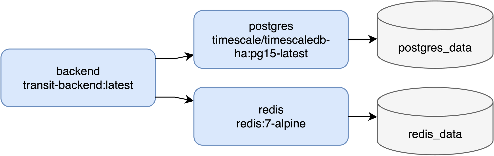

# 04-components.md — Every component, one at a time

**What this document is.** A part-by-part tour of the system. Each component gets three
questions answered — *what is it*, *why does it exist*, *what breaks without it* — plus the
files that implement it.

**Sources.** `docs/explain/00-inventory.md` (the mechanically-assembled repository inventory)
and, where a line number was needed that the inventory does not record, the source file
itself. Those direct reads are marked "(source, verified for this document)".

**Jargon.** Terms in *italics* on first use are defined in
[05-glossary.md](05-glossary.md) — that file is alphabetical, so look the term up by name.
Anchors are not linked because the glossary uses bold entries rather than headings.

**Status labels.** Where a component is broken, orphaned, or half-built, this document uses
the inventory's own labels from inventory §6, unchanged. Those labels, and several claims
below, cite "zone reports" — the nine per-directory extraction documents under
`docs/explain/raw/` that `00-inventory.md` was itself assembled from, before any source file
was read a second time (00-inventory.md's own header explains this method). "No zone report
records X" means none of those nine extraction passes found a caller for X — strong evidence
of dead code, not absolute proof.

| Label | Means |
|---|---|
| **CONFIRMED-DEAD** | A recorded `grep` proves zero references. |
| **NO-RECORDED-CALLER** | The symbol is defined and no zone report records any call site. Strong, not conclusive. |
| **UNREACHABLE-BY-INTERFACE** | The method exists on a concrete type but is absent from the *consumer-declared interface* through which that type is injected. No consumer can reach it through the wiring in `main.go`. |
| **DEAD PATH** | The code is reachable in principle, but the input that would reach it is never produced. |
| **TEST-ONLY** | Exercised by tests, no production call site recorded. |
| **PERMANENT GHOST** | A field the producing side can never fill. |

These labels are not softened anywhere below. If a component is half-built, that is stated in
the same paragraph as what it does.

---

## Part 1 — Backend components

The backend is one Go binary. The stated layering is
`handlers → services → repositories → database` (see *clean architecture* in the glossary).
Section 1.1 explains where that wiring is assembled; sections 1.2–1.10 walk the layers.

---

### 1.1 The composition root — `cmd/server/main.go`

**What is it?** The one file that builds every other object and connects them. It is the
program's `main()` function. It contains no business logic: it reads config, opens the
database and Redis, constructs five repositories, one cache wrapper, five services, the
WebSocket hub, six handlers, an *Echo* HTTP server, registers ten routes, and then blocks
until the process is told to stop (inventory §2.1).

Order, as recorded in inventory §2.1:

| Step | Line | Action |
|---|---|---|
| 1 | `main.go:48` | `config.LoadConfig()` |
| 2 | `main.go:56` | `database.New(cfg)` |
| 3 | `main.go:64` | `database.RunMigrations(...)` |
| 4 | `main.go:70` | `cache.New(cfg)` |
| 5 | `main.go:78-82` | 5 repositories |
| 6 | `main.go:85` | `cache.NewDeviceCache(redisClient)` |
| 7 | `main.go:88-91` | 4 services |
| 8 | `main.go:94-95` | `hub.New()`, then `go wsHub.Run()` |
| 9 | `main.go:98` | `services.NewIngestService(...)` |
| 10 | `main.go:101-106` | 6 handlers |
| 11 | `main.go:109-116` | Echo, middleware order Recovery → CORS → Logging |
| 12 | `main.go:121-153` | Route registration |
| 13 | `main.go:156-162` | `go func(){ e.Start(addr) }()` |
| 14 | `main.go:165-167` | Block on SIGINT/SIGTERM |
| 15 | `main.go:170-177` | `e.Shutdown(ctx)`, 10s timeout |

**Why does it exist?** So that no other file has to know how to build its own dependencies.
This is *dependency injection*: a handler is handed a service; a service is handed a
repository. That is what lets a service be tested against a fake repository instead of a real
database.

It also carries eleven *interface assertions* at `main.go:31-41` (inventory §1.3) — lines of
the form `var _ handlers.ArrivalService = (*services.ArrivalsService)(nil)`. These do nothing
at runtime. They fail the build if a concrete type stops satisfying the interface its consumer
declared. `main.go` is the only file that imports both an interface's package and its
implementation's package, which is why the assertions live here and not next to either.

**What breaks without it?** Everything. There is no other Go entry point —
`docs/audit/reports/00-entrypoints.txt:1` lists this file alone (inventory §2.1).

**Known gaps:**

- **The hub is never shut down.** `go wsHub.Run()` at `main.go:95` is fire-and-forget, and
  step 15 calls only `e.Shutdown(ctx)` (inventory §2.1). `hub.Run()` has no cancellation case
  to receive one anyway — see §1.6.
- **`main.go:153` registers `e.Static("/", "public")`, but the `COPY` that would put a
  `public/` directory into the runtime image is commented out at `backend/Dockerfile:63`**
  (inventory §6.7). No `public/` directory is recorded under `backend/` by any zone report.
  This static-file registration is separate from, and in addition to, the "ten routes" named
  above (`main.go:121-150`: `GET /health` plus nine handler-backed routes, inventory §3.1–§3.10)
  — `e.Static` at `main.go:153` is an eleventh registration in the same block, serving assets
  rather than routing to a handler, which is why the inventory itself lists it in its own
  subsection (§3.11) instead of folding it into the route count.
  The route is registered against a directory that does not ship. Inventory §7.7 records that
  no other document in the repo mentions this route at all.

**Files:** `backend/cmd/server/main.go` (179 lines, inventory §1.3).

---

### 1.2 Config loading — `internal/config/`

**What is it?** One struct and one function. `Config` has 16 fields (`config.go:12-38`);
`LoadConfig()` (`config.go:41-87`) reads environment variables into it, applying defaults
through `getEnvOrDefault` (`config.go:90-95`) and `getEnvAsInt` (`config.go:98-105`)
(inventory §1.5). It uses `godotenv` to load a `.env` file first if one exists
(`config/config.go:8`, and the `godotenv.Load()` call discards its error — inventory §8.1).

It validates three things: `DBName` non-empty (`config.go:74-75`), `DBUser` non-empty
(`config.go:77-78`), and `H3Resolution` in the range 0–15 (`config.go:82-84`)
(inventory §1.5).

**Why does it exist?** So the same binary can run against a local Postgres, a container
Postgres, or anything else, without a rebuild. Defaults live in `infra/docker-compose.yml`.

**What breaks without it?** The database host, port, credentials, and the listen address are
all read from here. Without it the binary cannot connect to anything.

**Half-built — seven environment variables do nothing.** Inventory §5.1 records two distinct
failure kinds:

*Parsed into `Config` and then never read by anything (4):*

| Variable | Parsed at | What is actually used |
|---|---|---|
| `REDIS_POOL_SIZE` | `config.go:59` | Hard-coded `PoolSize: 50` at `cache/redis.go:28` (source, verified for this document) |
| `H3_RESOLUTION` | `config.go:66`, **validated** at `:82-84` | Hard-coded `9` at `services/geofencing.go:22` and `database/locations.go:23` |
| `ENV` | `config.go:69` | Nothing — no recorded reader |
| `LOG_LEVEL` | `config.go:70` | Nothing — logging is bare `log.Printf` (`middleware/logging.go:25`, `recovery.go:17`, `errors.go:18`) |

`H3_RESOLUTION` is the most misleading of the four because it is validated, which reads as
evidence that it matters (inventory §5.1). Two constructors exist that would consume it —
`NewGeofencingServiceWithResolution` (`geofencing.go:26-33`) and
`NewLocationRepositoryWithResolution` (`locations.go:28-33`) — and both are
**NO-RECORDED-CALLER**; `main.go:78,88` calls the non-parameterised versions
(inventory §6.3, §6.4).

*Declared in `.env.example` and never parsed at all (3):* `WS_READ_BUFFER_SIZE`
(`.env.example:60`), `WS_WRITE_BUFFER_SIZE` (`:61`), `WS_PING_INTERVAL` (`:64`). None is a
`Config` field (`config.go:12-38`) and none appears in `docker-compose.yml:74-95`, so setting
them in the compose environment would not even reach the process (inventory §5.1). The values
in force are hard-coded `1024` at `handlers/websocket.go:13-19` and a `pingPeriod` derived from
`pongWait` at `hub/client.go:18`.

**Files:** `backend/internal/config/config.go` (106 lines), `.env.example` (72 lines).

---

### 1.3 The cache layer — `internal/cache/`

**What is it?** A Redis client behind a Go interface. Two files:

- `interface.go` (71 lines) declares the `CacheStore` interface with 10 methods (`:26-46`),
  a `DeviceLocation` struct (`:9-15`), a `Session` struct (`:18-22`), four *TTL* constants
  (`:52,55,58,61`), and four key-prefix constants (`:66-69`) (inventory §1.4).
- `redis.go` (228 lines) implements all of it on `RedisCache` (`:16-18`), constructed by
  `New(cfg)` (`:21-44`) (inventory §1.4).

**Why does it exist?** To hold each device's latest known location somewhere faster to read
than *TimescaleDB* — the *hot path*. A "where is device X right now" read hits memory instead
of a time-partitioned table.

**What breaks without it?** `IngestService` writes to it on every ping
(`cache/redis.go:184-205`, inventory §3.2). Removing it would not break any read path
currently wired — no handler reads from Redis — but the ingest write would fail.

**Broken and orphaned parts.** This is the most hollowed-out package in the backend *by
proportion of its own surface that is actually reachable* — not by raw count of dead items
(Part 4's index below lists more individual dead/orphaned entries for `services` than for
`cache`). `CacheStore` declares ten methods (`cache/interface.go:26-46`); as detailed below,
exactly one execution path through them is live in production.

- The wired path is the **legacy** one. `main.go:85,98` injects `cache.DeviceCache`
  (`redis.go:174-176`), a wrapper whose `SetDeviceState` (`redis.go:184-205`) is commented as
  a deprecated backward-compatibility shim at `redis.go:172-173` (inventory §6.2, §7.3.p).
- The purpose-built methods are unreachable. `RedisCache.SetDeviceLocation` /
  `.GetDeviceLocation` / `.DeleteDeviceLocation` (`redis.go:49-58, 62-79, 82-85`) are
  **UNREACHABLE-BY-INTERFACE**: `services.DeviceCache` (`services/interfaces.go:41-43`)
  declares only `SetDeviceState` (inventory §6.2).
- `DeviceCache.GetDeviceState` (`redis.go:208-224`) — **UNREACHABLE-BY-INTERFACE**. Nothing
  reads back what ingest writes.
- Session methods `SetSession` / `GetSession` / `DeleteSession` (`redis.go:90-99, 103-120,
  123-126`) — **UNREACHABLE-BY-INTERFACE**. `cache.Session` itself (`interface.go:18-22`) is
  **NO-RECORDED-CALLER**.
- Metric methods `SetMetric` / `GetMetric` (`redis.go:131-140, 144-156`) —
  **UNREACHABLE-BY-INTERFACE**.
- `RedisCache.Ping` (`redis.go:161-163`) — **NO-RECORDED-CALLER**.
- `SessionTTL`, `MetricTTL`, `NearbyBusesTTL` (`interface.go:55,58,61`) and `KeyPrefixSession`,
  `KeyPrefixMetric`, `KeyPrefixGeo` (`interface.go:67,68,69`) — all **NO-RECORDED-CALLER**.
- The `CacheStore` interface itself (`interface.go:26-46`) is **ASSERTION-ONLY**: its only
  recorded use is the compile-time check `var _ CacheStore = (*RedisCache)(nil)` at
  `redis.go:227`. `main.go:40` asserts `services.DeviceCache` instead (inventory §6.2).

In short: a 10-method cache interface exists, and exactly one method is reachable.

**Files:** `backend/internal/cache/interface.go`, `backend/internal/cache/redis.go`.

---

### 1.4 The database and repository layer — `internal/database/`

A *repository* holds SQL and returns Go structs. It contains no decisions about *whether* to
run the query — that belongs to a *service*.

*Entity-relationship diagram — the five tables described below and their foreign keys.*

#### 1.4.0 Pool and migration runner — `db.go`

**What is it?** `New(cfg)` (`db.go:17-51`) builds a `pgxpool.Pool` — a *connection pool* of
already-open Postgres connections, sized from `DB_MAX_CONNS`/`DB_MIN_CONNS`
(`db.go:31-32`, inventory §5.1). `RunMigrations(ctx, pool, fs.FS)` (`db.go:55-105`) applies
the four embedded `.sql` files in alphabetical order (`db.go:66-74`), tracking which have run
in a `schema_migrations` table it creates itself (`db.go:56-61`) (inventory §1.6, §4.6).

**Why does it exist?** Opening a Postgres connection is slow; the pool amortises it across
requests. The migration ledger means the schema is created by the binary, not by a manual
step.

**What breaks without it?** Every repository holds a `*pgxpool.Pool` (glossary, *pgx*). No
pool means no repository works, and the schema is never created.

**Known hazard — migrations apply twice on a fresh volume.**
`infra/docker-compose.yml:23` mounts `../backend/migrations` into
`/docker-entrypoint-initdb.d`, so Postgres runs every `.sql` at first init; the Go binary then
replays all four through its own empty ledger (`db.go:57`). Migrations 001–003 are idempotent.
`004_seed_data.sql` is not: its three `location_history` inserts
(`:94-99`, `:102-105`, `:108-111`) carry no `ON CONFLICT`, so **the 11 seed location rows are
inserted twice** (inventory §4.7). Any measurement taken against a fresh volume is measuring
22 rows where the seed says 11.

**Files:** `backend/internal/database/db.go` (106 lines),
`backend/migrations/migrations.go:5-6` (the `//go:embed *.sql` directive),
`backend/migrations/001..004_*.sql`.

#### 1.4.1 `LocationRepository` — `locations.go`

**What is it?** The repository for `location_history`, the time-series table. Seven methods
(inventory §1.6): `Insert` (`:47-75`), `GetBusesInHex` (`:79-111`), `GetBusesInHexes`
(`:114-150`), `GetBusesNearStop` (`:154-196`), `GetLatestLocation` (`:199-224`),
`GetNeighborHexes` (`:227-246`), `CalculateHex` (`:37-44`).

**Why does it exist?** It owns two different ways to answer "which devices are near here":
the *H3* hex-cell lookup (`hex_res9 = ANY($1)`, `locations.go:119-132`) and the exact
*PostGIS* distance test (`ST_DWithin`, `locations.go:157-178`). Both queries use
`SELECT DISTINCT ON (lh.device_id) ... ORDER BY lh.device_id, lh.time DESC` to reduce a
history table to one current row per device (inventory §3.7).

**What breaks without it?** Ingest cannot store a ping (`POST /api/location`), and
`GET /api/nearby/devices` returns nothing.

**Orphaned methods:**

- `GetBusesInHex` (singular, `:79-111`) — **UNREACHABLE-BY-INTERFACE**.
  `services.LocationRepository` (`services/interfaces.go:26-31`) declares the plural
  `GetBusesInHexes` and not the singular (inventory §6.3).
- `GetNeighborHexes` (`:227-246`) — **UNREACHABLE-BY-INTERFACE**. The live k-ring helper is
  `GeofencingService.GetNeighborHexes` (`services/geofencing.go:102-121`) instead
  (inventory §6.3).
- `NewLocationRepositoryWithResolution` (`:28-33`) — **NO-RECORDED-CALLER**; `main.go:78`
  calls `NewLocationRepository` (inventory §6.3).

**Files:** `backend/internal/database/locations.go` (247 lines).

#### 1.4.2 `RouteRepository` — `routes.go`

**What is it?** Two methods: `GetAll` (`:19-36`) and `Create` (`:40-90`) (inventory §1.6).
`Create` runs in a single transaction and inserts a route plus all of its stops, generating
IDs in SQL (`'route-' || substr(md5(random()::text), 1, 8)`, `routes.go:49-53`) and setting
each stop's PostGIS geometry inline
(`ST_SetSRID(ST_MakePoint($4::numeric, $3::numeric), 4326)`, `routes.go:64-70`)
(inventory §3.4).

**Why does it exist?** It backs the route-creator feature: an operator draws a route in the
browser and it is persisted as one route row plus N stop rows, atomically.

**What breaks without it?** `GET /api/routes` and `POST /api/routes` both fail. The
route-creator screen becomes a drawing tool with no save.

**Files:** `backend/internal/database/routes.go` (91 lines).

#### 1.4.3 `StopRepository` — `stops.go`

**What is it?** Four methods: `GetByRouteID` (`:22-50`), `GetByID` (`:53-65`), `GetNearby`
(`:68-101`), `GetAll` (`:104-127`) (inventory §1.6). `GetNearby` is the PostGIS query —
`ST_DWithin` to filter, `ST_Distance` to order (`stops.go:71-83`, inventory §3.8).

**Why does it exist?** Stops are the geofence targets. Arrivals, nearby-stop lookups, and the
sidebar's stop list all read through it.

**What breaks without it?** `GET /api/stops`, `GET /api/nearby/stops`, and `GET /api/arrivals`
(which needs `GetByID` to locate the target stop) all fail.

**Orphaned method:** `GetAll` (`:104-127`) — **UNREACHABLE-BY-INTERFACE**. The consumer
interface `services.StopRepository` (`services/interfaces.go:13-17`) declares only `GetByID`,
`GetByRouteID`, and `GetNearby` (inventory §6.3). This matters because
`GET /api/stops` hard-requires a `route_id` query parameter and returns 400 without one
(`handlers/stops.go:22`, inventory §3.5) — the method that would answer "all stops" is written
and unreachable at the same time as the endpoint refuses the question.

**Files:** `backend/internal/database/stops.go` (128 lines).

#### 1.4.4 `TripRepository` — `trips.go`

**What is it?** One method, `GetActiveTripsBeforeStop` (`:26-64`), and one struct,
`TripWithLocation` (`:17-24`) (inventory §1.6). The query joins `trips` to `devices` and then
uses a `LEFT JOIN LATERAL` to pull each device's single most recent location row
(`trips.go:30-46`, inventory §3.6).

**Why does it exist?** It answers "which vehicles are currently en route and have not yet
passed stop N", which is the input to arrival predictions.

**What breaks without it?** `GET /api/arrivals` returns an empty list — there is nothing to
predict arrivals *for*.

**Known state:** nothing in Go writes the `trips` table. `004_seed_data.sql:82-87` is the only
writer, 4 rows (inventory §4.5). Trip data is static. Inventory §7.3.l, citing the zone
reports, records `services/interfaces.go:6` as importing the `database` package so its
`TripRepository` interface could name the concrete `database.TripWithLocation` type — but that
claim is stale. Commit `fe918e0` moved `TripWithLocation` into `models` before the zone
reports were even written, so `interfaces.go:6` was already importing
`transit-backend/internal/models`, not `database`, by the time the zone report was produced
(verified directly against source for this document). The services package does not carry
that particular compile-time dependency on `database`.

**Files:** `backend/internal/database/trips.go` (65 lines).

#### 1.4.5 `DeviceRouteRepository` — `device_routes.go`

**What is it?** The smallest repository — one method, `GetActiveRouteID` (`:29-44`), running
one query: `SELECT route_id FROM trips WHERE device_id = $1 AND status = 'IN_PROGRESS'
ORDER BY started_at DESC LIMIT 1` (`device_routes.go:31-34`) (inventory §1.6, §3.2).

**Why does it exist?** So `route_id` on a broadcast message is derived on the server from the
device's active trip rather than accepted from the device on ingest. It is a separate file
from `trips.go` on purpose.

**What breaks without it?** Every broadcast message would carry an empty `route_id`, and the
frontend's per-route visibility filter (`hiddenRoutes`, `ui.ts:37`) would have nothing to
filter on.

**Cost note:** it runs once per ingested ping (inventory §3.2).

**Files:** `backend/internal/database/device_routes.go` (45 lines).

---

### 1.5 The handlers layer — `internal/handlers/`

**What is it?** The HTTP-facing layer. Six handler types plus one file of interfaces
(inventory §1.7):

| File | Handler | Endpoint |
|---|---|---|
| `location.go` (62) | `LocationHandler` (`:15-17`) | `POST /api/location` |
| `routes.go` (66) | `RouteHandler` (`:13-15`) | `GET`/`POST /api/routes` |
| `stops.go` (33) | `StopHandler` (`:11-13`) | `GET /api/stops` |
| `arrivals.go` (36) | `ArrivalHandler` (`:11-13`) | `GET /api/arrivals` |
| `nearby.go` (184) | `NearbyHandler` (`:15-17`) | `GET /api/nearby/devices`, `/nearby/stops`, `/geo/hex` |
| `websocket.go` (46) | `WebSocketHandler` (`:21-23`) | `GET /ws` |

`interfaces.go` (40 lines) declares the five service interfaces the handlers depend on:
`ArrivalService` (`:13-15`), `StopsService` (`:18-20`), `RoutesService` (`:23-26`),
`IngestService` (`:29-31`), `NearbyService` (`:34-39`).

**Why does it exist?** To parse and validate the request, call one service, and turn the result
into JSON — nothing else. `IngestLocation` (`location.go:27-61`) is the clearest case: it
binds the body, range-checks latitude, longitude, and speed (`:34-46`), defaults a missing
timestamp (`:45-46`), and hands everything else to `IngestService` (inventory §3.2).

The interfaces are declared *here*, in the consumer package, not next to the services. That is
what lets a handler be tested with a stub service.

**What breaks without it?** There is no HTTP surface at all.

**One exception to the interface rule:** `WebSocketHandler` holds a concrete `*hub.Hub`, not
an interface (`handlers/websocket.go:21-23`, inventory §1.7, §7.3.k). It is the only *handler*
that does — the identical pattern recurs one layer down, in `IngestService.hub` (§1.9.1 below,
`ingest.go:21`); both point at the same underlying gap, that the Hub was never given a consumer-
declared interface anywhere in the codebase.

**Security note, not a defect label:** the WebSocket *upgrader* has `CheckOrigin` hard-coded to
return `true` unconditionally (`handlers/websocket.go:13-19`, inventory §3.10). Any web page on
any origin can open a socket to this server.

**Files:** everything under `backend/internal/handlers/`.

---

### 1.6 The hub — `internal/hub/`

**What is it?** The component that owns the set of connected WebSocket clients and copies each
broadcast message to all of them — *fan-out*. Three files plus a test (inventory §1.8):

- `hub.go` (55 lines) — the `Hub` struct (`:7-13`), `New()` (`:15-22`), and `Run()` (`:24-54`).
  `Broadcast` is a *channel* buffered to 256 (`:17`); `Register` and `Unregister` are
  unbuffered (`:18-19`).
- `client.go` (94 lines) — one `Client` per socket (`:29-37`), with `ReadPump` (`:43-60`) and
  `WritePump` (`:66-93`). Timing constants: `writeWait=10s` (`:12`), `pongWait=60s` (`:15`),
  `pingPeriod` derived from those (`:18`), `maxMessageSize=512` (`:21`).
- `message.go` (22 lines) — the wire struct `Message`, 9 fields (`:7-17`), and the single
  message-type constant `MsgTypeLocationUpdate = "LOCATION_UPDATE"` (`:20`).
- `message_test.go` (85 lines) — asserts the serialized JSON shape.

**Why does it exist?** One ingested ping must reach every open browser. Without a hub, the
ingest path would need to know about individual sockets. Instead it writes one message to one
channel.

`Message` has **no `omitempty` on any field** (`message.go:7-17`). That is deliberate: a
stopped device must serialize `"speed": 0` rather than omitting the key, so the browser can
tell "stopped" apart from "not reported". `message_test.go` pins this down — it asserts 9 keys
present, no `data` wrapper (`:48-49`), no `heading` key (`:51-52`), and `speed` present and
zero (`:55-61`), with a second test for zero coordinates (`:64-84`).

**What breaks without it?** The map goes static. HTTP polling would still return positions;
nothing would push them.

**Broken — no shutdown path.** `Run()` (`hub.go:24-54`) is an infinite `for { select { } }`
over three channels with **no context or done case** (inventory §1.8). It is started
fire-and-forget at `main.go:95` and graceful shutdown at `main.go:170-177` calls only
`e.Shutdown(ctx)` (inventory §2.1, step 15). The per-client `ReadPump` and `WritePump` loops
have the same shape and the same gap (inventory §3.10).

**Silent data loss by design, undocumented at the call site.** `hub.go:43-49` is a `default:`
branch on a full client buffer — a slow browser silently drops messages rather than blocking
the hub (inventory §1.8). Whether that is the right trade-off is a separate question; what
matters here is that nothing counts or logs the drops.

**Files:** `backend/internal/hub/`.

---

### 1.7 The middleware chain — `internal/middleware/`

**What is it?** Four Echo middleware functions, applied in the order Recovery → CORS → Logging
at `main.go:109-116` (inventory §2.1, step 11):

| File | Function | What it does |
|---|---|---|
| `recovery.go` (32) | `Recovery` (`:12-31`) | Catches a panic, logs `debug.Stack()` (`:17`), returns 500 (`:25`) |
| `cors.go` (14) | `CORS()` (`:8-14`) | `AllowOrigins: ["*"]`, methods GET/POST/OPTIONS, header `Content-Type` (`:10-12`) |
| `logging.go` (30) | `Logging` (`:10-30`) | `log.Printf` of method, path, status, latency (`:25`) |
| `errors.go` (27) | `HTTPErrorHandler` (`:9-20`) | Turns any error into JSON `{"error": …}` (`:19`) |

**Why does it exist?** Cross-cutting concerns that every route needs and no route should
implement. Recovery is first in the chain so it wraps the other two: a panic inside CORS or
logging is still caught.

**What breaks without it?** Without `Recovery`, one panic in one handler kills the whole
process — every connected WebSocket client included. Without `CORS`, the browser blocks every
request from the Vite dev server, because it runs on a different port (see *CORS* in the
glossary). Without `HTTPErrorHandler`, errors come back in Echo's default shape rather than
the `{"error": …}` envelope the frontend's Axios interceptor expects.

**Known state:** `AllowOrigins: ["*"]` allows every origin (inventory §1.9). Logging is
unstructured `log.Printf` at three call sites (`logging.go:25`, `recovery.go:17`,
`errors.go:18`), and the `LOG_LEVEL` variable that would control verbosity has no reader —
see §1.2 (inventory §5.1).

**Files:** `backend/internal/middleware/`.

---

### 1.8 The models package — `internal/models/`

**What is it?** Five files of plain data structs with no behavior (inventory §1.10):

| File | Structs |
|---|---|
| `device.go` (8) | `Device` (`:3-7`) |
| `location.go` (36) | `Location` (`:4-12`), `LocationUpdate` (`:15-24`), `NearbyBus` (`:27-35`) |
| `route.go` (31) | `Route` (`:3-7`), `CreateRouteRequest` (`:10-14`), `CreateStopInput` (`:17-21`), `CreateRouteResponse` (`:24-30`) |
| `stop.go` (10) | `Stop` (`:3-9`) |
| `trip.go` (17) | `Trip` (`:3-9`), `ArrivalEvent` (`:11-16`) |

**Why does it exist?** So a repository, a service, and a handler can pass the same shape
around without any of them importing another's package.

**What breaks without it?** `Location` is what `POST /api/location` binds into
(`handlers/location.go:28`); `NearbyBus` is what the nearby queries scan into;
`CreateRouteRequest` is the route-creator body. Those three carry the live paths.

**Four of eleven structs are dead or orphaned** (two CONFIRMED-DEAD, two NO-RECORDED-CALLER —
see the "Status labels" legend at the top of this document; "dead" here is a summary word for
the heading, not a third status):

| Struct | Status | Evidence (inventory §6.1) |
|---|---|---|
| `models.Device` (`device.go:3-7`) | **CONFIRMED-DEAD** | `grep -rn "models.Device" --include="*.go" backend/` returns no output |
| `models.Trip` (`trip.go:3-9`) | **CONFIRMED-DEAD** | `grep -rn "models\.Trip\b"` — zero hits |
| `models.ArrivalEvent` (`trip.go:11-16`) | **NO-RECORDED-CALLER** | The `/api/arrivals` response type is `services.ArrivalPrediction` (`handlers/interfaces.go:14`), not this |
| `models.LocationUpdate` (`location.go:15-24`) | **NO-RECORDED-CALLER** | The wire type is `hub.Message` (`hub/message.go:7-17`) |

`models.Device` is worth dwelling on: the `devices` **table** is live and joined in raw SQL at
`database/locations.go:78,113,158` and `database/trips.go:34`, but every one of those queries
scans into `models.NearbyBus` or `database.TripWithLocation` — never into `models.Device`
(inventory §4.1). The table has a Go struct mirroring it and nothing uses the struct.

**Files:** `backend/internal/models/`.

---

### 1.9 The services layer — `internal/services/`

A *service* decides what to do and calls one or more repositories to do it. Its repository
interfaces are declared in `interfaces.go` (51 lines) — six of them: `StopRepository`
(`:13-17`), `TripRepository` (`:20-22`), `LocationRepository` (`:26-31`), `RouteRepository`
(`:34-37`), `DeviceCache` (`:41-43`), `DeviceRouteRepository` (`:48-50`) (inventory §1.11).

#### 1.9.1 `IngestService` — `ingest.go`

**What is it?** One method, `IngestLocation` (`ingest.go:29-81`), which performs four
operations for every incoming ping: resolve the device's active route
(`DeviceRouteRepository.GetActiveRouteID`), insert the durable row
(`LocationRepository.Insert`), update the Redis hot state (`DeviceCache.SetDeviceState`), and
push a `hub.Message` into the broadcast channel (inventory §3.2).

**Why does it exist?** It is the reason a handler stays thin. All four of those operations
belong together and none of them is an HTTP concern.

**What breaks without it?** Ingest is the system's whole write path. Without it there is no
persistence, no cache, and no live update.

**Layering wrinkle:** `IngestService.hub` is a concrete `*hub.Hub` (`ingest.go:21`), not an
interface (inventory §1.11, §7.3.k). A test cannot substitute a fake hub.

**Files:** `backend/internal/services/ingest.go` (82 lines).

#### 1.9.2 `GeofencingService` — `geofencing.go`

**What is it?** The largest service, 224 lines, 13 functions (inventory §1.11). It owns the H3
math and the "what is near this point" decision.

The live method is `FindNearbyBuses` (`:123-156`). It branches at `geofencing.go:129`: for a
radius of 500m or less it uses the H3 k-ring path, computing `k := (radiusMeters / 175) + 1`
(`:132`) capped at 5 (`:134`), and calls
`LocationRepository.GetBusesInHexes(ctx, hexes, 5)` at `:144`. For a larger radius it goes
straight to PostGIS via `GetBusesNearStop` at `:155` (inventory §3.7).

**Why does it exist?** Hex-cell equality is an O(1) index lookup, so it is cheap; but hex cells
have hard edges and misjudge points near a boundary. PostGIS `ST_DWithin` is exact and more
expensive. The service picks between them by radius.

**What breaks without it?** `GET /api/nearby/devices`, `GET /api/nearby/stops`, and
`GET /api/geo/hex` all fail. `ArrivalsService` also holds it and calls `GetNeighborHexes` for
approach detection.

**Half the service is unreachable:**

| Method | Status | Evidence (inventory §6.4) |
|---|---|---|
| `IsAtStop` (`:56-62`) | **UNREACHABLE-BY-INTERFACE** | `handlers.NearbyService` (`handlers/interfaces.go:34-39`) declares only `FindNearbyBuses`, `FindNearbyStops`, `CalculateHex`, `GetHexResolution` |
| `IsAtStopWithHysteresis` (`:64-100`) | **NO-RECORDED-CALLER** | Contains the only 1-ring `h3.GridDisk(stopCell, 1)` in the codebase, at `:87` |
| `DetectArrival` (`:165-178`) | **NO-RECORDED-CALLER** | — |
| `DetectDeparture` (`:180-190`) | **NO-RECORDED-CALLER** | — |
| `HexEdgeLengthMeters` (`:197-223`) | **TEST-ONLY** | Exercised by `geofencing_test.go:65-87`, no production call site |
| `NewGeofencingServiceWithResolution` (`:26-33`) | **NO-RECORDED-CALLER** | `main.go:88` calls `NewGeofencingService` |

The four arrival/departure detection methods are the geofence *event* logic. They are written
and nothing calls them: the system computes proximity but emits no enter/exit events.

**Files:** `backend/internal/services/geofencing.go` (224 lines),
`geofencing_test.go` (148 lines — 6 tests, all against the two pure functions
`CalculateHexAtResolution` and `HexEdgeLengthMeters`, inventory §1.11).

#### 1.9.3 `ArrivalsService` — `arrivals.go`

**What is it?** 166 lines. The live method is `GetArrivalsForStop` (`:44-82`), which returns
`[]ArrivalPrediction` (`:33-42`). It looks up the stop (`StopRepository.GetByID`), finds active
trips that have not yet passed it (`TripRepository.GetActiveTripsBeforeStop`), and for each
computes straight-line distance and an *ETA* using `geo.Haversine` and `geo.CalculateETA`.
`isApproaching` (`:113-131`) asks `geoService.GetNeighborHexes(stopLat, stopLng, 3)` at
`arrivals.go:116` — a *k-ring* of radius 3, roughly 500m at resolution 9 — and reports true if
the device's hex is in that set (inventory §3.6).

**Why does it exist?** It converts raw positions into the one number the sidebar shows:
minutes until arrival.

**What breaks without it?** `GET /api/arrivals` returns nothing, and the sidebar's arrivals
list is empty.

**Layering wrinkle:** `ArrivalsService.geoService` is a concrete `*GeofencingService`
(`arrivals.go:14`), not an interface (inventory §1.11, §7.3.k).

**Three of five methods unreachable** (inventory §6.4) — `handlers.ArrivalService`
(`handlers/interfaces.go:13-15`) declares only `GetArrivalsForStop`:

- `GetNearbyArrivals` (`:84-111`) — **UNREACHABLE-BY-INTERFACE**
- `CalculateETAWithTraffic` (`:133-146`) — **UNREACHABLE-BY-INTERFACE**. This is the only place
  the 1.2× traffic multiplier (`arrivals.go:143`) appears anywhere in the codebase.
- `DetectArrivalEvent` (`:148-165`) — **UNREACHABLE-BY-INTERFACE**

`ArrivalPrediction.HexRes9` (`arrivals.go:40`) is **FLAGGED** in inventory §6.4 as assigned
with no visible consumer in that file — but the frontend does read it:
`transformers.ts:23` maps `raw[schema.hexRes9]`.

**Files:** `backend/internal/services/arrivals.go`.

#### 1.9.4 `RoutesService` — `routes.go`

**What is it?** 28 lines, two pass-through methods: `GetRoutes` (`:19-22`) and `CreateRoute`
(`:24-27`), each delegating to `RouteRepository` (inventory §1.11, §3.3, §3.4).

**Why does it exist?** So `RouteHandler` depends on a service interface like every other
handler, rather than reaching into a repository. There is no business logic here yet — the
layer exists for uniformity and to give route-creation somewhere to grow.

**What breaks without it?** `GET`/`POST /api/routes` fail.

**Files:** `backend/internal/services/routes.go`.

#### 1.9.5 `StopsService` — `stops.go`

**What is it?** 23 lines, one method: `GetStopsByRoute` (`:19-22`), delegating to
`StopRepository.GetByRouteID` (inventory §1.11, §3.5).

**Why does it exist?** Same reason as `RoutesService` — it keeps `StopHandler` off the
repository.

**What breaks without it?** `GET /api/stops` fails.

**Note the shape of the gap:** this service exposes exactly one method, and the repository
underneath it has four (§1.4.3). `GetAll` is on the wrong side of the interface.

**Files:** `backend/internal/services/stops.go`.

---

### 1.10 Pure math — `pkg/geo/`

**What is it?** Two functions and three constants, in 38 lines, with no I/O, no state, no
logging (inventory §1.12):

- Constants `EarthRadiusKm = 6371.0`, `MinSpeedKmh = 1.0`, `DefaultSpeed = 20.0`
  (`distance.go:5-7`).
- `Haversine(lat1, lng1, lat2, lng2)` (`:12-24`) — *great-circle distance* between two
  latitude/longitude points, treating the earth as a sphere.
- `CalculateETA` (`:26-37`) — `distance / speed`, with a fallback: if the reported speed is
  below `MinSpeedKmh`, `DefaultSpeed` (20 km/h) is substituted.

**Why does it exist?** Separated from everything else so it can be tested with no setup at all.
`distance_test.go` (45 lines) covers both functions including the `DefaultSpeed` fallback
branch (`:39-41`).

**What breaks without it?** Every ETA in the system, and the distance term in every arrival
prediction.

**Honest limits, not defects:** the distance is straight-line, not along-road — see
*along-route distance* in the glossary. And the `DefaultSpeed` fallback means a device that is
stopped is predicted as if it were doing 20 km/h.

**Files:** `backend/pkg/geo/distance.go`, `backend/pkg/geo/distance_test.go`.

---

## Part 2 — Infrastructure

*Container view — the three services defined in `infra/docker-compose.yml`.*

### 2.1 PostgreSQL

**What is it?** The relational database. Five application tables — `devices`, `routes`,
`stops`, `location_history`, `trips` — plus `schema_migrations`, which the Go binary creates at
runtime rather than in any `.sql` file (inventory §4).

**Why does it exist?** It is the durable record. Redis holds only the latest position per
device and can be lost without data loss; Postgres holds every ping ever received.

**What breaks without it?** Everything except the WebSocket handshake. `main.go:56` connects
before anything else is constructed, and a failure there stops startup.

**Files:** `backend/migrations/001_create_tables.sql` (54 lines) defines the tables;
`002_add_indexes.sql` (6) and `003_add_h3_postgis.sql` (119) add columns, indexes, and the
geometry trigger; `004_seed_data.sql` (140) seeds 5 devices, 3 routes, 15 stops, 4 trips, and
11 location rows.

### 2.2 TimescaleDB — what it adds on top of plain Postgres

**What is it?** A Postgres *extension*, not a separate database engine. The container image is
`timescale/timescaledb-ha:pg15-latest` (inventory §2.3) — Postgres 15 with the extension
pre-installed. Enabled by `001_create_tables.sql:2`.

**What it adds that plain Postgres does not have:**

1. **Hypertables.** `create_hypertable('location_history', 'time', if_not_exists => TRUE)` at
   `001_create_tables.sql:43` (inventory §4.4) converts one table into a set of time-ranged
   chunks behind the scenes. Application code still writes plain
   `INSERT INTO location_history` (`database/locations.go:60-63`) and still reads plain
   `SELECT`; the partitioning is invisible to the Go code. What changes is that a query
   restricted by time only touches the chunks covering that range instead of scanning the
   whole table.
2. **A compression policy.** `003_add_h3_postgis.sql:76-79` sets `timescaledb.compress` with
   `compress_segmentby = 'device_id'`, and `:87` adds
   `add_compression_policy('location_history', INTERVAL '7 days')` (inventory §4.4). Rows older
   than seven days are automatically rewritten into a compressed columnar form. Plain Postgres
   has no equivalent automatic age-based compaction.

**What breaks without it?** Not the functionality — `location_history` would still work as an
ordinary table, and every query in the codebase would still run. What is lost is the
time-partitioning and the compression. On a system whose whole premise is high-frequency
inserts to one table, that is the difference between a table that stays queryable and one that
grows without bound.

`location_history` is the only hypertable in the schema (inventory §4).

### 2.3 PostGIS — what it adds on top of plain Postgres

**What is it?** Another Postgres extension, enabled by `001_create_tables.sql:3`
(inventory §4).

**What it adds that plain Postgres does not have:**

1. **Geometry column types.** `stops.geom` and `location_history.geom` are
   `GEOMETRY(POINT, 4326)` — a point in the WGS 84 coordinate system, the same
   latitude/longitude system a GPS device reports (inventory §4.3, §4.4). Plain Postgres could
   store two numeric columns but has no type that knows they are a point on a globe.
2. **Spatial functions in SQL.** `ST_DWithin` answers "is this point within N metres of that
   one" directly in the `WHERE` clause (`database/locations.go:157-178`,
   `database/stops.go:71-83`); `ST_Distance` returns the metre distance and is used both as a
   returned column and as an `ORDER BY` key (inventory §3.7, §3.8);
   `ST_SetSRID(ST_MakePoint(lng, lat), 4326)` builds a point from two numbers
   (`database/routes.go:64-70`). Without them, "find every device within 500m" would have to
   be computed in Go over every row.
3. **GIST indexes on geometry.** `idx_stops_geom` (`002_add_indexes.sql:2`) and
   `idx_location_history_geom` (`003_add_h3_postgis.sql:32-33`) are *GIST indexes* — an index
   structure that can answer "what is near this point", which a normal B-tree index cannot
   (inventory §4.3, §4.4). Without them the `ST_DWithin` queries above would still return
   correct answers, by scanning every row.
4. **A trigger that fills geometry automatically.** `update_location_geom()`
   (`003_add_h3_postgis.sql:97-105`) sets
   `NEW.geom := ST_SetSRID(ST_MakePoint(NEW.longitude, NEW.latitude), 4326)`, wired as
   `trg_location_geom BEFORE INSERT FOR EACH ROW` (`003:108-118`) (inventory §4.4). The Go
   `Insert` writes seven columns and never mentions `geom` (`database/locations.go:60-63`) —
   the database derives it.

**What breaks without it?** `GET /api/nearby/stops` (which has no H3 path at all — it goes
straight to `StopRepository.GetNearby`), and the large-radius branch of
`GET /api/nearby/devices`, which falls back to `ST_DWithin` for anything over 500m
(`services/geofencing.go:129,155`).

**Note on `geom` for `location_history`:** inventory §4.4 flags that no zone report records an
`ADD COLUMN` statement for `geom` on this table, even though the trigger populates it and a
GIST index is built on it. That is an unresolved gap in the inventory, recorded here rather
than guessed at.

### 2.4 Redis

**What is it?** An in-memory key-value store, run as `redis:7-alpine` with
`--maxmemory 256mb --maxmemory-policy allkeys-lru --appendonly yes`
(`infra/docker-compose.yml:38,40-44`, inventory §2.3).

**What it adds over having no cache at all:** a read of "where is device X right now" that
does not touch the time-series table. `IngestService` writes the device's latest state on every
ping via `DeviceCache.SetDeviceState` (`cache/redis.go:184-205`), in addition to the Postgres
insert (inventory §3.2). The `allkeys-lru` policy means that when the 256MB cap is reached,
Redis evicts least-recently-used keys rather than refusing writes — appropriate for a cache,
where losing an entry costs a slower read and nothing else.

**What breaks without it?** In practice, less than the architecture implies. Nothing currently
reads the cache back: `DeviceCache.GetDeviceState` is **UNREACHABLE-BY-INTERFACE** (§1.3), and
no handler queries Redis. `main.go:70` connects at startup and would fail there, so the binary
would not start — but the read benefit the cache exists to provide is not yet claimed by any
code path.

### 2.5 Docker Compose

**What is it?** One YAML file, 126 lines, defining three containers and wiring them together
(`infra/docker-compose.yml`, inventory §1.14, §2.3):

| Service | Image / build | Notable settings |
|---|---|---|
| `postgres` | `timescale/timescaledb-ha:pg15-latest` (`:13`) | `../backend/migrations` mounted read-only into `/docker-entrypoint-initdb.d` (`:23`) |
| `redis` | `redis:7-alpine` (`:38`) | `--maxmemory 256mb --maxmemory-policy allkeys-lru --appendonly yes` (`:40-44`) |
| `backend` | built from `../backend/Dockerfile` (`:64-65`) | `depends_on` both services being healthy (`:96-100`); `CMD ["./server"]` (`backend/Dockerfile:79`) |

Plus two *volumes*, `postgres_data` and `redis_data` (`:114-118`), and one *bridge network*,
`transit-network` (`:123-125`).

**What it adds over running three processes by hand:** three things specifically.

1. **Name resolution.** The bridge network lets the backend container reach the database at the
   hostname `postgres` rather than at an IP address that changes on every restart.
2. **Startup ordering.** `depends_on` with health conditions (`:96-100`) holds the backend
   until Postgres and Redis pass their own health checks. Without it the backend starts first,
   fails to connect at `main.go:56`, and exits.
3. **Persistence across restarts.** The two named volumes survive `docker compose down`;
   a container's own writable layer does not.

`infra/docker-compose.yml` is also where most environment defaults are declared (`:74-95`,
inventory §5.1) — which is why the three `WS_*` variables that exist only in `.env.example` can
never reach the process (§1.2).

**What breaks without it?** `./deploy.sh` calls `make docker-up` (inventory §1.1). Everything
below that line — the whole local stack — is this file.

**Known hazard:** the migration mount at `:23` is one half of the double-application problem
described in §1.4.0. The mount is what makes Postgres run the seed file before the Go binary
does.

---

## Part 3 — Frontend components

The frontend is a *SPA* built with React 19, TypeScript, and Vite. It has no router: `App.tsx`
is a single static layout (inventory §2.2), so it is a single-*screen* application, not just a
single-page one.

### 3.1 React and the component tree

**What is it?** React renders the UI from state. `main.tsx:5-9` mounts one root component,
`<App />`, inside `<StrictMode>`, into `
` (`index.html:15`) (inventory §2.2).

`App.tsx` (42 lines) mounts five children directly and nothing else (inventory §1.16):
`Sidebar` (`:16`), `MapContainer` (`:20`), `ConnectionStatus` (`:25`), `OperationsPanel`
(`:31`), `TelemetryTray` (`:36`). It imports `./styles/globals.css` (`:6`) and **not**
`./App.css`.

**Why does it exist?** Components declare what the screen should look like for a given state;
React updates the actual DOM. Nothing in this codebase touches the DOM by hand.

**What breaks without it?** There is no UI.

**Dead files:** `frontend/src/App.css` is **CONFIRMED-DEAD** — a recorded grep confirms no
`.ts`/`.tsx` file under `frontend/src/` imports it (inventory §6.5). It is Vite starter
boilerplate (`#root`, `.logo`, `.card`, `logo-spin` keyframes, inventory §1.16).
`frontend/src/assets/react.svg` is likewise **CONFIRMED-DEAD** — `grep -rn "react.svg"` over
`frontend/src/` returns no matches. `frontend/src/utils/` is an **EMPTY DIRECTORY**
(inventory §6.5).

### 3.2 Zustand — the store and its five slices

**What is it?** One global *store*, `useStore`, composed from five independent *slices*
(`store/index.ts:15`, inventory §1.18; the composition is a spread of five slice creators,
source, verified for this document):

| Slice | File | Holds |
|---|---|---|
| `busLocations` | `busLocations.ts` (20) | `buses: Map<string, BusLocation>` (`:16`); actions `setBuses` (`:17`), `updateBus` (`:18`) |
| `arrivals` | `arrivals.ts` (47) | `arrivals.byStopId: Map` (`:18-20`); `setArrivals` (`:21-26`), `updateArrival` (`:27-45`) |
| `stops` | `stops.ts` (22) | `stops: Stop[]` (`:17`), `routes: Route[]` (`:18`) |
| `connection` | `connection.ts` (42) | `connection` (`:18-21`), `health` (`:22-26`); `setConnectionStatus`, `updateHeartbeat`, `setHealth` (`:27-40`) |
| `ui` | `ui.ts` (149) | `notifications` (`:12`), `selectedStopId` (`:15`), `followedBusId` (`:17`), route-creator state (`:21-24`), `layerVisibility: { stops, buses }` (`:36`), `hiddenRoutes` (`:37`), 16 actions (`:64-147`) |

**Why does it exist?** The WebSocket handler and the map are not in a parent/child
relationship. Without a store, a location update arriving in a service module would have no way
to reach a Leaflet marker except by threading props through every component between them.

**What breaks without it?** Live updates would arrive and go nowhere.

**Note on the H3 grid toggle:** the "H3 Spatial Grid" toggle that earlier documents describe is
**gone**. `OperationsPanel.tsx` has exactly two layer toggles, `stops` (`:40-46`) and `buses`
(`:49-56`); `ui.ts:36` is `layerVisibility: { stops, buses }` with no `grid` key
(inventory §7.2.f, §7.4.e). `frontend/src/utils/h3Helpers.ts` is not on disk — it appears only
in a stale audit file tree (inventory §6.5, §6.7). Any document still prescribing its deletion
is describing work already done.

**Dead store members** (inventory §6.6):

- `ui.notifications` plus `addNotification` and `removeNotification` (`ui.ts:12,64-76`) —
  **NO-RECORDED-CALLER**. No component reads the notifications array or calls either action. A
  notification system exists in state and has no producer and no display.
- `busLocations.setBuses` (`busLocations.ts:17`) — **NO-RECORDED-CALLER**. Only `updateBus` is
  called, from the WebSocket message handler.
- `arrivals.updateArrival` (`arrivals.ts:27-45`) — **DEAD PATH**. Its only caller is
  `handleArrivalUpdate`, which is itself dead (§3.7).
- `connection.updateHeartbeat` (`connection.ts:34-39`) — **PARTIALLY DEAD**: called only
  from the dead `handleHeartbeat`. `setConnectionStatus` in the same file is live, used by the
  WebSocket client's lifecycle handlers.

### 3.3 Leaflet and react-leaflet — the map

**What is it?** Leaflet draws the map; `react-leaflet` gives it a React-component interface so
tiles, markers, and polylines are declared as JSX rather than created imperatively. All seven
files under `components/Map/` import both (inventory §8.3).

`MapContainer.tsx` (65 lines) is the shell: `<LeafletMap zoom={13}>` (`:36`), CartoDB Dark
Matter *tile server* (`:42-47`), and six child components mounted at `:50-61` — those are
`MapCameraHandler`, `MapClickHandler`, `RoutePolyline`, `BusMarkers`, `StopMarkers`, and
`RouteCreatorMarkers` (source, verified for this document). **`MapContainer` reads no store
state at all** (inventory §1.17) — every child subscribes to what it needs.

The six children:

| Component | Lines | What it does |
|---|---|---|
| `BusMarkers.tsx` | 108 | Builds a marker icon (`createBusBlipIcon()`, `:12-25`); reads `buses` (`:28`), `layerVisibility` (`:29`), `hiddenRoutes` (`:30`); sets `followedBusId` on click (`:89`) |
| `StopMarkers.tsx` | 115 | Renders stops; its popup is an inline `StopPopupContent` component (`:32`) that calls `useArrivals(stopId)` (`:33`); reads `layerVisibility` (`:88`); sets `selectedStopId` on click (`:100`) |
| `RoutePolyline.tsx` | 72 | `getCoordinates()` (`:12-18`); draws three stacked `<Polyline>` layers (`:34-65`) for a glow effect |
| `RouteCreatorMarkers.tsx` | 133 | Draggable numbered waypoints (`:116-129`); an effect (`:49-77`) calls OSRM's `getRouteGeometry` (`:65`) to snap them to roads |
| `MapCameraHandler.tsx` | 83 | Follows the selected device (`:22-33`); a manual drag cancels follow (`:36-47`) |
| `MapClickHandler.tsx` | 23 | `useMapEvents` click → `addCreatorStop` (`:13-16`) |

(All from inventory §1.17.)

**Why does it exist?** The map is the product's one screen. Everything else is a control panel
around it.

**What breaks without it?** There is nothing to look at.

**External dependency:** the tiles come from CartoDB's public server on every render
(`MapContainer.tsx:44`, glossary *tile server*), and `RouteCreatorMarkers` calls the public
*OSRM* demo instance at `https://router.project-osrm.org/route/v1/driving`
(`services/api/osrm.ts:9`, called at `RouteCreatorMarkers.tsx:65`), falling back to straight
lines if the call fails (`osrm.ts:36`) (inventory §3.12). Note that inventory §7.5.a records
`docs/audit/ESSENCE.md:6` claiming OSRM was stripped out; it is live.

### 3.4 The Sidebar components

| Component | Lines | What it does |
|---|---|---|
| `Sidebar/Sidebar.tsx` | 180 | The container. Reads `selectedStopId`, `connection`, `buses`, `routeCreatorMode` (`:12-18`); mounts `ArrivalsList` and `RouteCreatorPanel` (`:7-9`) |
| `Sidebar/OperationsPanel.tsx` | 103 | Two layer toggles — `stops` (`:40-46`), `buses` (`:49-56`) — and a per-route visibility list (`:71-90`) |
| `Sidebar/RouteCreatorPanel.tsx` | 237 | The route-creator form; submits via `createRoute(...)` (`:37`) |
| `Sidebar/ArrivalsList.tsx` | 97 | Calls `useArrivals(stopId)` (`:15`), renders one `ArrivalCard` per prediction |
| `Sidebar/ArrivalCard.tsx` | 70 | Presentational; takes an `arrival: Arrival` prop (`:13-15`) |
| `Sidebar/StopDetails.tsx` | 45 | Presentational; takes a `stop: Stop` prop (`:8-10`) |

(inventory §1.17.)

**Why do they exist?** The map shows position; the sidebar shows the numbers — arrivals, route
filters, and the route-creation form.

**What breaks without them?** Route creation has no UI, and arrival predictions are computed by
the backend and never displayed.

**Orphaned:** `Sidebar/StopDetails.tsx` is **NO-RECORDED-CALLER** (inventory §6.5). No
component in the 26-file frontend zone imports it. `Sidebar.tsx:7-9` imports only `ArrivalsList`
and `RouteCreatorPanel`, and `StopMarkers.tsx:32` uses its own inline `StopPopupContent`
instead. A stop-detail panel is written and never mounted.

### 3.5 Header and Footer

- `Header/ConnectionStatus.tsx` (51 lines) calls `useHealthCheck()` (`:10`) and
  `useWebSocket()` (`:11`) (inventory §1.17).
- `Footer/TelemetryTray.tsx` (91 lines) runs a clock on `setInterval` (`:23`) and reads
  `connection` (`:11`).

**Worth knowing:** `useWebSocket()` is invoked from `ConnectionStatus.tsx:11`, so **the app's
only live socket is opened as a side effect of rendering the header status widget**
(inventory §2.2). If that component is ever unmounted or moved, the socket goes with it.

### 3.6 The hooks — `frontend/src/hooks/`

| Hook | Lines | What it does |
|---|---|---|
| `useWebSocket.ts` | 25 | `wsClient.connect()` on mount, `.disconnect()` on unmount (`:13-21`) |
| `useHealthCheck.ts` | 38 | Polls `checkHealth()` on an interval, default 30000ms (`:15-24`) |
| `useArrivals.ts` | 50 | `fetchArrivals(stopId)` (`:30`) → `setArrivals` (`:31`) |
| `useRoutes.ts` | 50 | `fetchRoutes()` (`:23`), with an early-exit cache when `routes.length > 0` |
| `useStops.ts` | 57 | `fetchStops('route-101')` (`:28`) |

(inventory §1.18.)

**Why do they exist?** They are the seam between React's lifecycle and everything outside it —
network calls, timers, the WebSocket. A component calls a hook; the hook does the fetching and
writes to the store.

**What breaks without them?** `useWebSocket` is the only thing that opens the socket. Without
`useArrivals`, the sidebar and the stop popups show nothing.

**Hard-coded value:** `useStops.ts:28` always requests `'route-101'` (inventory §1.18). The
route id is not derived from anything. Related: `fetchStops()`'s optional-`routeId` branch
(`services/api/stops.ts:10`) is **NO-RECORDED-CALLER**, and `GET /api/stops` would return 400
for it anyway (`handlers/stops.go:22`) (inventory §6.6).

### 3.7 The service modules — `frontend/src/services/`

**HTTP (`services/api/`).** One shared *Axios* instance in `client.ts` (84 lines): the instance
at `:19-26`, a request interceptor at `:29-37`, and a response interceptor handling 400, 404,
429, 500, and 503 at `:40-83`. Every other module calls through it (inventory §1.19):
`arrivals.ts` (30), `routes.ts` (23), `stops.ts` (32), `createRoute.ts` (19), `health.ts` (25),
plus `osrm.ts` (41), which calls the external routing service. `transformers.ts` (120) converts
snake_case API responses into the frontend's camelCase domain types.

**WebSocket (`services/websocket/`).** `websocketClient.ts` (83 lines) is a *singleton*: one
`WebSocketClient` (`:11-81`) with `connect()` (`:16-59`), `disconnect()` (`:61-67`), and
`scheduleReconnect()` (`:69-79`), exported as an instance at `:82`. `messageHandler.ts`
(132 lines) is the receiving end: `handleMessage` switches over six cases plus a default
(`:20-48`).

**Why do they exist?** Centralised error handling and one place that knows the wire format.
Nothing else in the app calls `fetch` or constructs a `WebSocket`.

**What breaks without them?** No data reaches the store at all.

**Dead and half-built — this is the largest concentration of dead code in the frontend:**

- **Eight of nine declared WebSocket message types have no backend emitter.**
  `WS_CONFIG.messageTypes` declares nine literals (`wsConfig.ts:14-30`); `hub/message.go:20`
  defines exactly one, `"LOCATION_UPDATE"`. The other eight — `connected`, `disconnected`,
  `heartbeat`, `heartbeat_ack`, `arrival_update`, `route_update`, `system_message`, `error` —
  are **DEAD** (inventory §6.6).
- Consequently five handlers are **DEAD PATH**: `handleArrivalUpdate`
  (`messageHandler.ts:94-113`), `handleRouteUpdate` (`:115-119`), `handleHeartbeat`
  (`:121-123`), `handleConnected` (`:21`), and `handleError` (`:125-131`). Only
  `handleLocationUpdate` (`:61-92`) ever runs.
- `WS_CONFIG.schemas.arrivalUpdate` / `.routeUpdate` / `.heartbeat` (`wsConfig.ts:51-69`) —
  **DEAD**, consumed only by those handlers.
- `WS_CONFIG.heartbeatInterval` (`wsConfig.ts:9`) — **NO-RECORDED-CALLER**. The client uses
  only `WS_CONFIG.url` (`:23`) and `WS_CONFIG.reconnectInterval` (`:72`). There is a heartbeat
  interval configured and no heartbeat.
- `transformBus` (`transformers.ts:69-94`) — **NO-RECORDED-CALLER**. The other three
  transformers each have a caller; this one does not. It is also the only reader of
  `raw[schema.heading]` (`transformers.ts:79`).
- `services/errorHandler.ts` (`handleError`, `AppError`) — **NO-RECORDED-CALLER**. Every
  recorded error path calls `logger.error` directly instead (inventory §6.5).
- `services/errorHandler.ts:49` contains a code literal typo, `'UNKNOWN_ObJECT'`
  (inventory §1.19). Dead code, so it has never mattered.
- `services/logger.ts` (50 lines) has its level fixed to `'debug'` at `:11` — there is no way to
  quiet it.

### 3.8 `BusLocation.heading` — a PERMANENT GHOST

Called out separately because it is a different failure from the ones above.

`frontend/src/types/domain.ts:41-50` declares `heading: number` as a **required,
non-optional** field on `BusLocation`. The backend's wire struct `hub.Message`
(`hub/message.go:7-17`) has no `heading` field, and `message_test.go:51-52` asserts that the
key is *absent* from the serialized message (inventory §6.6, §7.3.o).

The producing side can never fill it. The inventory labels it **PERMANENT GHOST**. The type
system says every bus has a heading; no message ever carries one.

### 3.9 Vite — the build tool

**What is it?** The dev server and production bundler. `vite.config.ts` (13 lines) registers
the React plugin (`:7`) and an `@` → `./src` path alias (`:8-11`). Scripts are in
`package.json:7-10`: `dev`, `build` (`tsc -b && vite build`), `lint`, `preview`
(inventory §1.15, §8.4).

**Why does it exist?** Browsers do not run TypeScript or JSX. Vite compiles both, and during
development it serves modules without rebuilding the whole bundle on each edit.

**What breaks without it?** `deploy.sh:70-96` runs `npm install` and `npm run build`, then
serves the result with `npm run preview` (`:120`) (inventory §1.1). No build, no frontend.

**TypeScript settings worth knowing:** `tsconfig.app.json` sets `strict: true` (`:20`) and both
`noUnusedLocals` and `noUnusedParameters` (`:21-22`) (inventory §1.15). Note that those two
flags catch unused *locals*, not unused module-level exports — which is why the dead
transformers and handlers in §3.7 compile cleanly.

### 3.10 Tailwind — styling

**What is it?** A utility-first CSS framework: styles are applied as class names in markup
rather than written in separate rule blocks. `tailwind.config.js` (60 lines) defines a custom
`hud` colour palette (`:9-23`), a Space Mono font stack (`:25-26`), and four keyframes
(`:32-48`) with matching animations (`:50-55`). It runs through PostCSS
(`postcss.config.js:3`) alongside `autoprefixer` (`:4`) (inventory §1.15, §8.4).

Not everything is Tailwind: `styles/globals.css` (245 lines) holds the `@tailwind` directives
(`:1-3`), ten `--hud-*` CSS custom properties (`:9-31`), 30 hand-written selector blocks, two
keyframes (`radar-ping` at `:105`, `scanline-sweep` at `:158`), and a base64-encoded SVG
`feTurbulence` noise texture in `.noise-overlay` (`:215-224`) (inventory §1.16).

**Why does it exist?** It gives the demo a consistent look without a separate stylesheet per
component.

**What breaks without it?** The app renders unstyled. No behavior changes.

**External dependency:** the Space Mono webfont is loaded from a remote source on every page
load (`index.html:10-12`, inventory §1.15).

### 3.11 Three declared npm dependencies with zero imports

`frontend/package.json` declares nine runtime dependencies. Three of them are imported nowhere
under `frontend/src/` (inventory §8.3):

| Package | Version | What it would do |
|---|---|---|
| `clsx` | ^2.1.1 | Conditional CSS class-name composition |
| `date-fns` | ^4.1.0 | Date formatting and parsing |
| `lucide-react` | ^0.562.0 | Icon components |

The inventory records `grep -rn` over `frontend/src/` returning zero matches for each. All
three ship in `package-lock.json` and install on every `npm install`. Inventory §8.3 notes this
was not previously recorded anywhere, because §6 (dead code) covers dead *symbols* and not
unused *packages*.

---

## Part 4 — Consolidated dead-code index

Everything above, in one place, for scanning. Statuses are the inventory's, unchanged
(inventory §6, §8.3).

### Backend

| Component | Symbol | Status |
|---|---|---|
| models | `models.Device` (`device.go:3-7`) | CONFIRMED-DEAD |
| models | `models.Trip` (`trip.go:3-9`) | CONFIRMED-DEAD |
| models | `models.ArrivalEvent` (`trip.go:11-16`) | NO-RECORDED-CALLER |
| models | `models.LocationUpdate` (`location.go:15-24`) | NO-RECORDED-CALLER |
| cache | `cache.Session` (`interface.go:18-22`) | NO-RECORDED-CALLER |
| cache | `SetSession`/`GetSession`/`DeleteSession` (`redis.go:90-99,103-120,123-126`) | UNREACHABLE-BY-INTERFACE |
| cache | `SetMetric`/`GetMetric` (`redis.go:131-140,144-156`) | UNREACHABLE-BY-INTERFACE |
| cache | `SetDeviceLocation`/`GetDeviceLocation`/`DeleteDeviceLocation` (`redis.go:49-58,62-79,82-85`) | UNREACHABLE-BY-INTERFACE |
| cache | `DeviceCache.GetDeviceState` (`redis.go:208-224`) | UNREACHABLE-BY-INTERFACE |
| cache | `RedisCache.Ping` (`redis.go:161-163`) | NO-RECORDED-CALLER |
| cache | `SessionTTL`/`MetricTTL`/`NearbyBusesTTL` (`interface.go:55,58,61`) | NO-RECORDED-CALLER |
| cache | `KeyPrefixSession`/`KeyPrefixMetric`/`KeyPrefixGeo` (`interface.go:67-69`) | NO-RECORDED-CALLER |
| cache | `CacheStore` interface (`interface.go:26-46`) | ASSERTION-ONLY |
| database | `StopRepository.GetAll` (`stops.go:104-127`) | UNREACHABLE-BY-INTERFACE |
| database | `LocationRepository.GetBusesInHex` singular (`locations.go:79-111`) | UNREACHABLE-BY-INTERFACE |
| database | `LocationRepository.GetNeighborHexes` (`locations.go:227-246`) | UNREACHABLE-BY-INTERFACE |
| database | `NewLocationRepositoryWithResolution` (`locations.go:28-33`) | NO-RECORDED-CALLER |
| services | `ArrivalsService.GetNearbyArrivals` (`arrivals.go:84-111`) | UNREACHABLE-BY-INTERFACE |
| services | `ArrivalsService.CalculateETAWithTraffic` (`arrivals.go:133-146`) | UNREACHABLE-BY-INTERFACE |
| services | `ArrivalsService.DetectArrivalEvent` (`arrivals.go:148-165`) | UNREACHABLE-BY-INTERFACE |
| services | `GeofencingService.IsAtStop` (`geofencing.go:56-62`) | UNREACHABLE-BY-INTERFACE |
| services | `GeofencingService.IsAtStopWithHysteresis` (`geofencing.go:64-100`) | NO-RECORDED-CALLER |
| services | `GeofencingService.DetectArrival` (`geofencing.go:165-178`) | NO-RECORDED-CALLER |
| services | `GeofencingService.DetectDeparture` (`geofencing.go:180-190`) | NO-RECORDED-CALLER |
| services | `GeofencingService.HexEdgeLengthMeters` (`geofencing.go:197-223`) | TEST-ONLY |
| services | `NewGeofencingServiceWithResolution` (`geofencing.go:26-33`) | NO-RECORDED-CALLER |
| services | `ArrivalPrediction.HexRes9` (`arrivals.go:40`) | FLAGGED — but read by `transformers.ts:23` |

### Frontend

| Component | Symbol | Status |
|---|---|---|
| files | `App.css` | CONFIRMED-DEAD |
| files | `assets/react.svg` | CONFIRMED-DEAD |
| files | `Sidebar/StopDetails.tsx` | NO-RECORDED-CALLER |
| files | `services/errorHandler.ts` | NO-RECORDED-CALLER |
| files | `src/utils/` | EMPTY DIRECTORY |
| types | `BusLocation.heading` (`domain.ts:41-50`) | PERMANENT GHOST |
| ws | 8 of 9 `WS_CONFIG.messageTypes` (`wsConfig.ts:14-30`) | DEAD |
| ws | `handleArrivalUpdate` (`messageHandler.ts:94-113`) | DEAD PATH |
| ws | `handleRouteUpdate` (`messageHandler.ts:115-119`) | DEAD PATH |
| ws | `handleHeartbeat` (`messageHandler.ts:121-123`) | DEAD PATH |
| ws | `handleConnected` (`messageHandler.ts:21`) | DEAD PATH |
| ws | `handleError` (`messageHandler.ts:125-131`) | DEAD PATH |
| ws | `WS_CONFIG.schemas.arrivalUpdate`/`.routeUpdate`/`.heartbeat` (`wsConfig.ts:51-69`) | DEAD |
| ws | `WS_CONFIG.heartbeatInterval` (`wsConfig.ts:9`) | NO-RECORDED-CALLER |
| api | `transformBus` (`transformers.ts:69-94`) | NO-RECORDED-CALLER |
| api | `fetchStops()` no-arg branch (`stops.ts:10`) | NO-RECORDED-CALLER |
| store | `ui.notifications` + `addNotification` + `removeNotification` (`ui.ts:12,64-76`) | NO-RECORDED-CALLER |
| store | `busLocations.setBuses` (`busLocations.ts:17`) | NO-RECORDED-CALLER |
| store | `arrivals.updateArrival` (`arrivals.ts:27-45`) | DEAD PATH |
| store | `connection.updateHeartbeat` (`connection.ts:34-39`) | PARTIALLY DEAD |
| deps | `clsx`, `date-fns`, `lucide-react` | Declared, zero imports (inventory §8.3) |

### Configuration and infrastructure

| Item | Status |
|---|---|
| `REDIS_POOL_SIZE`, `H3_RESOLUTION`, `ENV`, `LOG_LEVEL` | Parsed into `Config`, never read (inventory §5.1) |
| `WS_READ_BUFFER_SIZE`, `WS_WRITE_BUFFER_SIZE`, `WS_PING_INTERVAL` | In `.env.example` only; never parsed (inventory §5.1) |
| `main.go:153` `e.Static("/", "public")` | Serves a directory the image never receives — `backend/Dockerfile:63` `COPY` is commented out (inventory §6.7, §7.7) |
| `004_seed_data.sql:94-99,102-105,108-111` | No `ON CONFLICT`; 11 seed rows inserted twice on a fresh volume (inventory §4.7) |
| `=` (repo root) | STRAY file, 7 bytes, content `31.3.2` (inventory §6.7) |

---

## DEVIATIONS

**Diagrams.** Both requested images exist and are embedded:

- `docs/diagrams/er-diagram.drawio.png` — embedded in Part 1 §1.4, above the repository
  sections.
- `docs/diagrams/container-view.drawio.png` — embedded at the top of Part 2.

**Line numbers read directly from source.** The inventory does not record these, so they were
verified against the file and are marked as such in the text:

1. `cache/redis.go:28` — `PoolSize: 50`. Inventory §7.1.b explicitly records that *no zone
   report* captured a `PoolSize` literal in `redis.go`, and that `CLAUDE.md`'s citation of
   `redis.go:26` points at the `cfg.RedisPassword` line instead. The literal is at `:28`.
2. The six children mounted by `MapContainer.tsx:50-61`. The inventory records the line range
   and the count but not the component names.
3. `store/index.ts` composing the five slices by spread. The inventory records `:15` and the
   slice names; the mechanism was confirmed directly.

**Unresolved in the inventory, carried forward rather than guessed at.** Inventory §4.4 notes
that no zone report records an `ADD COLUMN` statement for `location_history.geom`, even though
a trigger populates it (`003_add_h3_postgis.sql:97-105,108-118`) and a GIST index is built on
it (`003:32-33`). This document states that gap rather than inventing the missing statement.

**Line-number disagreements between zone reports.** Inventory §7.8 records seven citations
where `zone-4.md` and `zone-4-recheck.md` differ by one to three lines
(`distance.go` constants, `geofencing.go:IsAtStop`, `geofencing.go:FindNearbyBuses`,
`arrivals.go` k-ring, `arrivals.go:GetArrivalsForStop`, `arrivals.go:isApproaching`). Where
this document cites those symbols it uses the `zone-4-recheck.md` figure, which is what
inventory §1.11–§1.12 record as primary.

**Not covered here.** The `Makefile` (~70 targets), `deploy.sh`, `cleanup.sh`, and
`healthcheck.sh` are operator tooling rather than system components, and are inventoried at
§1.1–§1.2 and §2.4. `docs/audit/`, `docs/backend_lld.md`, and `docs/component_documentation.md`
are prior-audit output, not source; inventory §7.5 (14 entries) and §7.6 (13 entries) record 27
places where they contradict the code.
